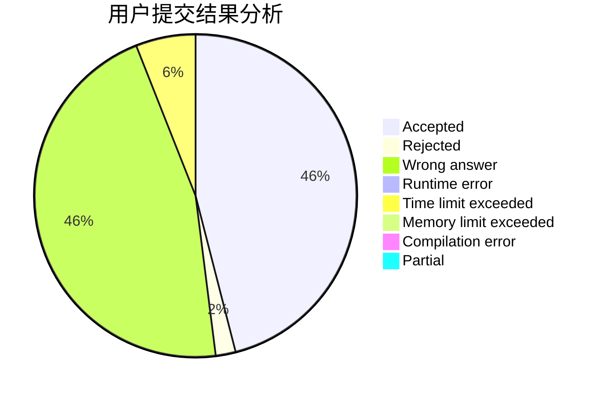
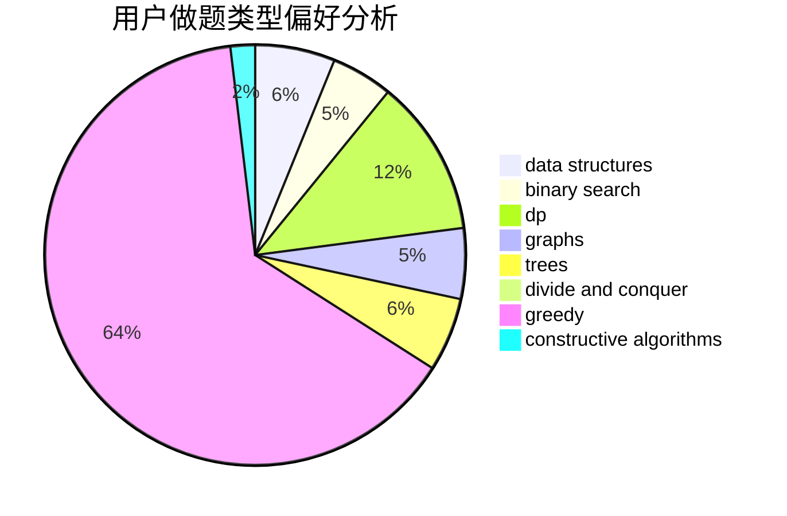
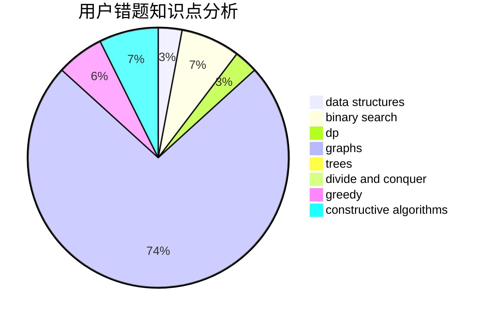

# qwerta

<!-- tabs:start -->

#### **用户提交结果分析**

#### **用户做题类型偏好分析**

#### **用户错题知识点分析**

<!-- tabs:end -->
# 推荐题目
[1301F](https://codeforces.com/contest/1301/problem/F)		dfs and similar,
                        graphs,
                        implementation,
                        shortest paths		  
[1413C](https://codeforces.com/contest/1413/problem/C)		binary search,
                        brute force,
                        dp,
                        implementation,
                        sortings,
                        two pointers		  
[1423I](https://codeforces.com/contest/1423/problem/I)		bitmasks		  
[611G](https://codeforces.com/contest/611/problem/G)		geometry,
                        two pointers		  
[590D](https://codeforces.com/contest/590/problem/D)		dp		  
[354B](https://codeforces.com/contest/354/problem/B)		bitmasks,
                        dp,
                        games		  
[739E](https://codeforces.com/contest/739/problem/E)		brute force,
                        data structures,
                        dp,
                        flows,
                        math,
                        probabilities,
                        sortings		  
[299B](https://codeforces.com/contest/299/problem/B)		brute force,
                        implementation		  
[1015D](https://codeforces.com/contest/1015/problem/D)		constructive algorithms,
                        greedy		  
[1388B](https://codeforces.com/contest/1388/problem/B)		greedy,
                        math		  
