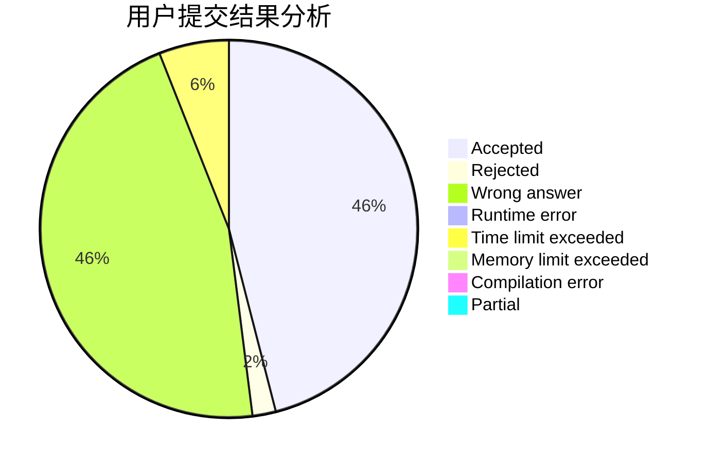
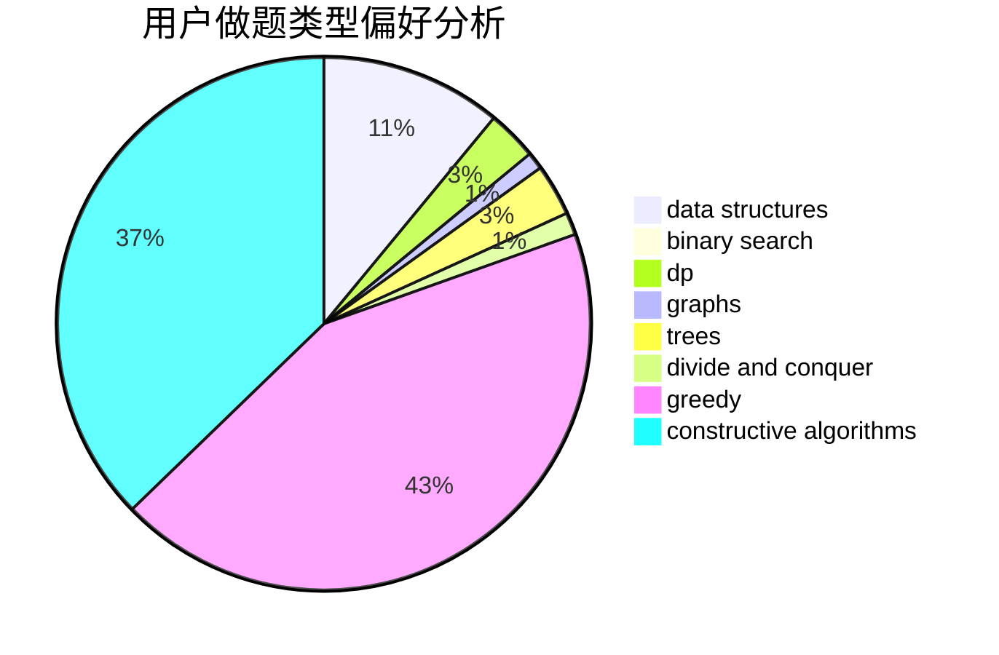

# qwerta

<!-- tabs:start -->

#### **用户提交结果分析**

#### **用户做题类型偏好分析**

#### **用户错题知识点分析**

<!-- tabs:end -->
# 推荐题目
[1311C](https://codeforces.com/contest/1311/problem/C)		brute force		  
[1422E](https://codeforces.com/contest/1422/problem/E)		dp,
                        greedy,
                        implementation,
                        strings		  
[1431D](https://codeforces.com/contest/1431/problem/D)		*special problem,
                        greedy		  
[630R](https://codeforces.com/contest/630/problem/R)		games,
                        math		  
[610B](https://codeforces.com/contest/610/problem/B)		constructive algorithms,
                        implementation		  
[380A](https://codeforces.com/contest/380/problem/A)		binary search,
                        brute force		  
[760A](https://codeforces.com/contest/760/problem/A)		implementation,
                        math		  
[3161](https://codeforces.com/contest/316/problem/1)		dsu,graphs,sortings,trees		  
[1015F](https://codeforces.com/contest/1015/problem/F)		dp,
                        strings		  
[1397E](https://codeforces.com/contest/1397/problem/E)		dsu,graphs,sortings,trees		  
