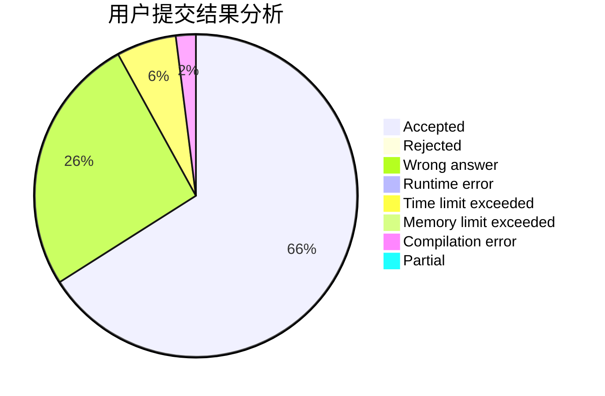
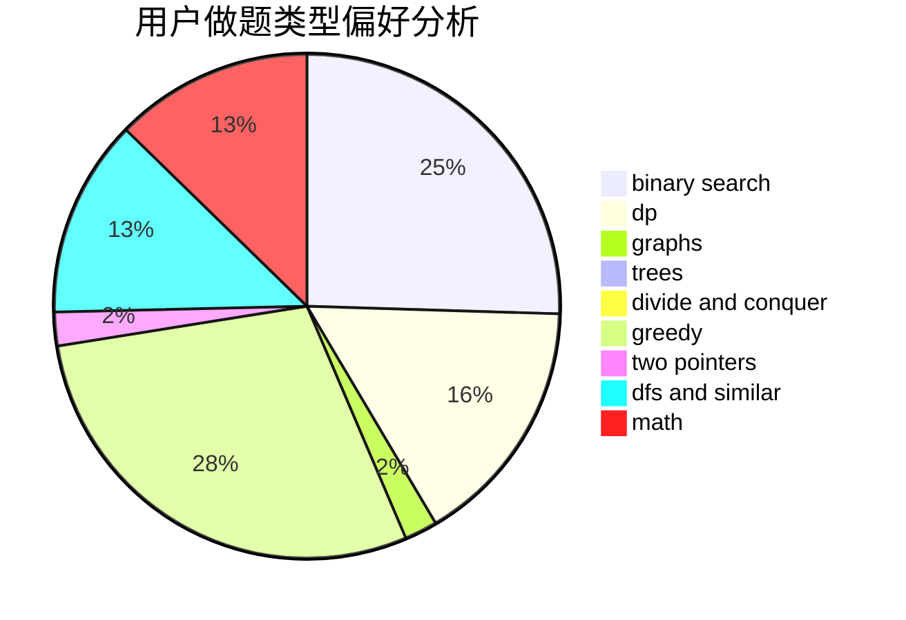

# qwqc

<!-- tabs:start -->

#### **用户提交结果分析**

#### **用户做题类型偏好分析**

<!-- tabs:end -->
# 推荐题目
[681A](https://codeforces.com/contest/681/problem/A)
[900B](https://codeforces.com/contest/900/problem/B)
[1271F](https://codeforces.com/contest/1271/problem/F)
[490F](https://codeforces.com/contest/490/problem/F)
[6702](https://codeforces.com/contest/670/problem/2)
[1031C](https://codeforces.com/contest/1031/problem/C)
[1335B](https://codeforces.com/contest/1335/problem/B)
[263C](https://codeforces.com/contest/263/problem/C)
[472F](https://codeforces.com/contest/472/problem/F)
[1140B](https://codeforces.com/contest/1140/problem/B)
