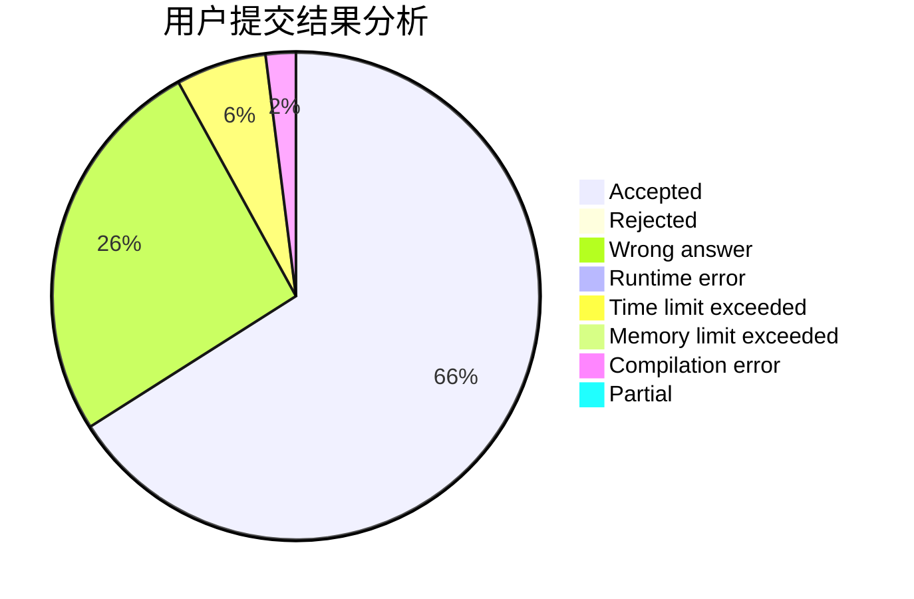
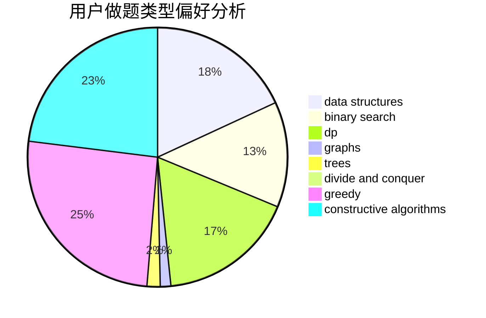
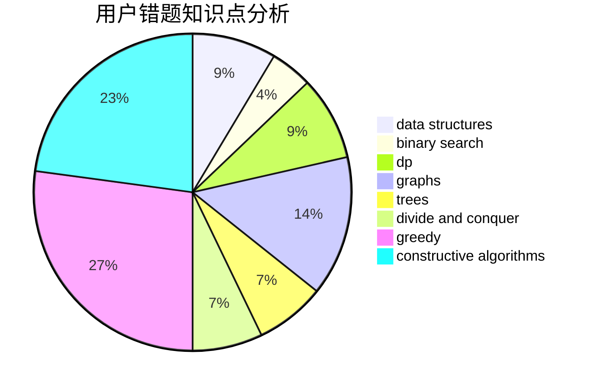

# qwqc

<!-- tabs:start -->

#### **用户提交结果分析**

#### **用户做题类型偏好分析**

#### **用户错题知识点分析**

<!-- tabs:end -->
# 推荐题目
[681A](https://codeforces.com/contest/681/problem/A)		implementation		  
[900B](https://codeforces.com/contest/900/problem/B)		math,
                        number theory		  
[1271F](https://codeforces.com/contest/1271/problem/F)		brute force		  
[490F](https://codeforces.com/contest/490/problem/F)		data structures,
                        dfs and similar,
                        dp,
                        trees		  
[6702](https://codeforces.com/contest/670/problem/2)		dsu,graphs,sortings,trees		  
[1031C](https://codeforces.com/contest/1031/problem/C)		greedy		  
[1335B](https://codeforces.com/contest/1335/problem/B)		constructive algorithms		  
[263C](https://codeforces.com/contest/263/problem/C)		brute force,
                        dfs and similar,
                        implementation		  
[472F](https://codeforces.com/contest/472/problem/F)		constructive algorithms,
                        math,
                        matrices		  
[1140B](https://codeforces.com/contest/1140/problem/B)		implementation,
                        strings		  
