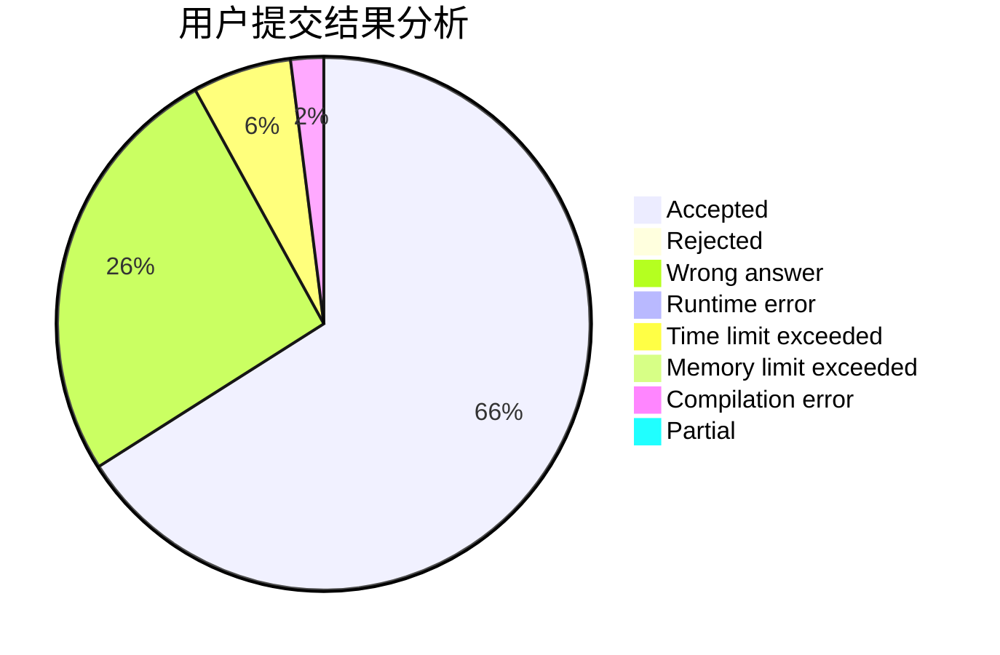
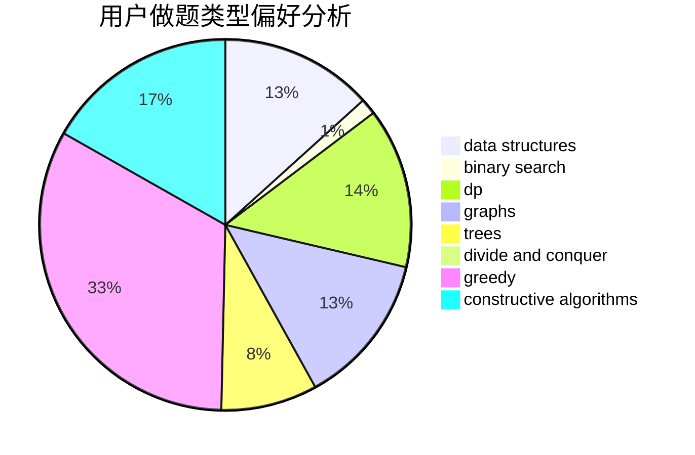
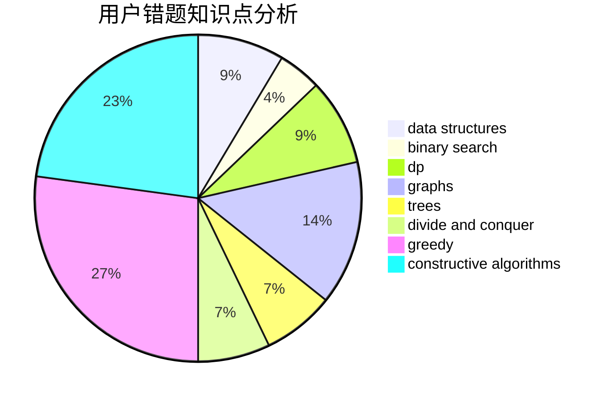

# qwqc

<!-- tabs:start -->

#### **用户提交结果分析**

#### **用户做题类型偏好分析**

#### **用户错题知识点分析**

<!-- tabs:end -->
# 推荐题目
[660C](https://codeforces.com/contest/660/problem/C)		binary search,
                        dp,
                        two pointers		  
[883C](https://codeforces.com/contest/883/problem/C)		binary search,
                        implementation		  
[1266E](https://codeforces.com/contest/1266/problem/E)		data structures,
                        greedy,
                        implementation		  
[472C](https://codeforces.com/contest/472/problem/C)		greedy		  
[641E](https://codeforces.com/contest/641/problem/E)		data structures		  
[1030G](https://codeforces.com/contest/1030/problem/G)		number theory		  
[1329B](https://codeforces.com/contest/1329/problem/B)		bitmasks,
                        combinatorics,
                        math		  
[241E](https://codeforces.com/contest/241/problem/E)		graphs,
                        shortest paths		  
[451D](https://codeforces.com/contest/451/problem/D)		math		  
[1138D](https://codeforces.com/contest/1138/problem/D)		dsu,graphs,sortings,trees		  
