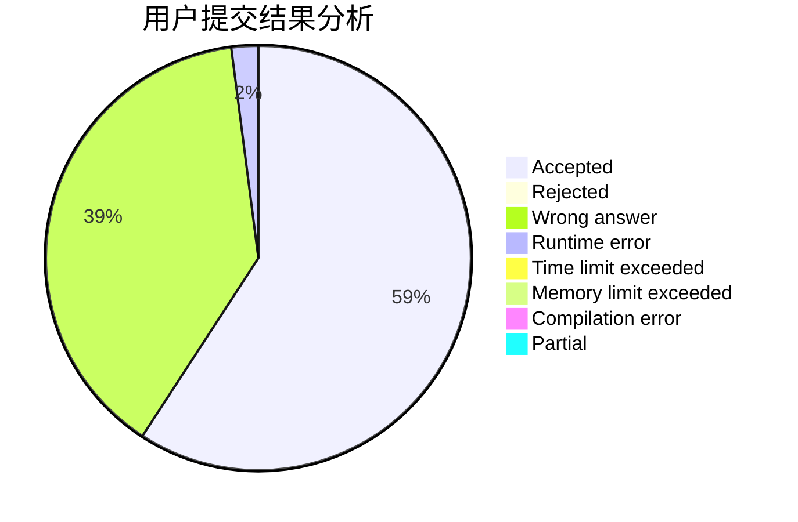
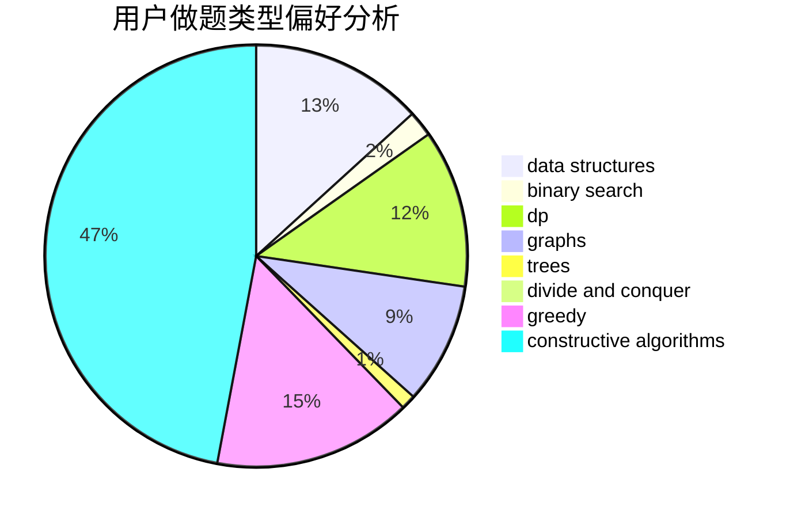
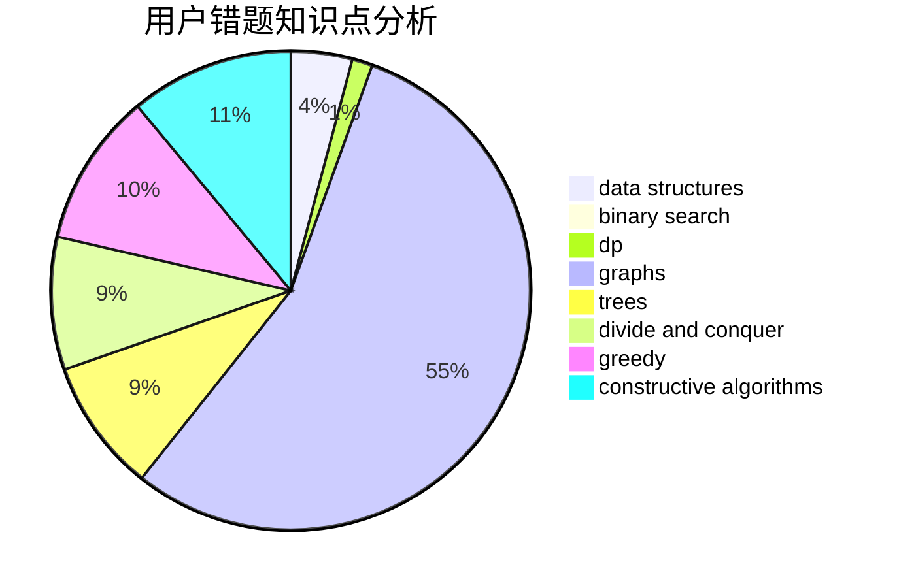

# qwqhr

<!-- tabs:start -->

#### **用户提交结果分析**

#### **用户做题类型偏好分析**

#### **用户错题知识点分析**

<!-- tabs:end -->
# 推荐题目
[1146A](https://codeforces.com/contest/1146/problem/A)		implementation,
                        strings		  
[1408A](https://codeforces.com/contest/1408/problem/A)		constructive algorithms		  
[755D](https://codeforces.com/contest/755/problem/D)		data structures		  
[830E](https://codeforces.com/contest/830/problem/E)		constructive algorithms,
                        dp,
                        graphs,
                        implementation,
                        math,
                        trees		  
[1090A](https://codeforces.com/contest/1090/problem/A)		greedy		  
[988F](https://codeforces.com/contest/988/problem/F)		dp		  
[574C](https://codeforces.com/contest/574/problem/C)		dsu,graphs,sortings,trees		  
[1245F](https://codeforces.com/contest/1245/problem/F)		bitmasks,
                        brute force,
                        combinatorics,
                        dp		  
[78C](https://codeforces.com/contest/78/problem/C)		dp,
                        games,
                        number theory		  
[29B](https://codeforces.com/contest/29/problem/B)		implementation		  
