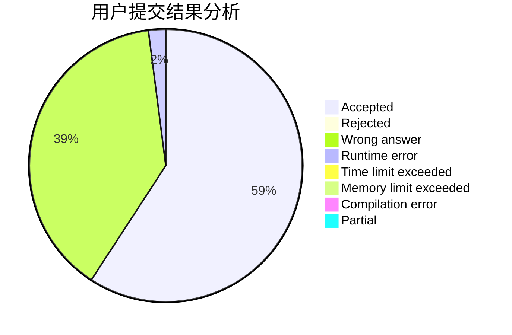
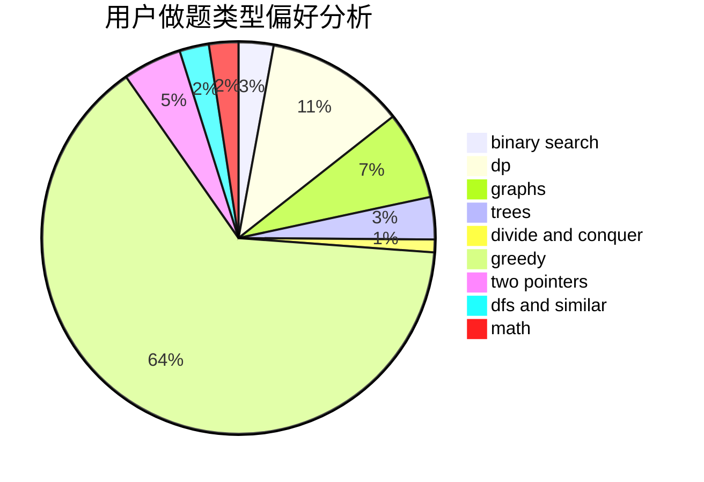

# qwqhr

<!-- tabs:start -->

#### **用户提交结果分析**

#### **用户做题类型偏好分析**

<!-- tabs:end -->
# 推荐题目
[1146A](https://codeforces.com/contest/1146/problem/A)
[1408A](https://codeforces.com/contest/1408/problem/A)
[755D](https://codeforces.com/contest/755/problem/D)
[830E](https://codeforces.com/contest/830/problem/E)
[1090A](https://codeforces.com/contest/1090/problem/A)
[988F](https://codeforces.com/contest/988/problem/F)
[574C](https://codeforces.com/contest/574/problem/C)
[1245F](https://codeforces.com/contest/1245/problem/F)
[78C](https://codeforces.com/contest/78/problem/C)
[29B](https://codeforces.com/contest/29/problem/B)
