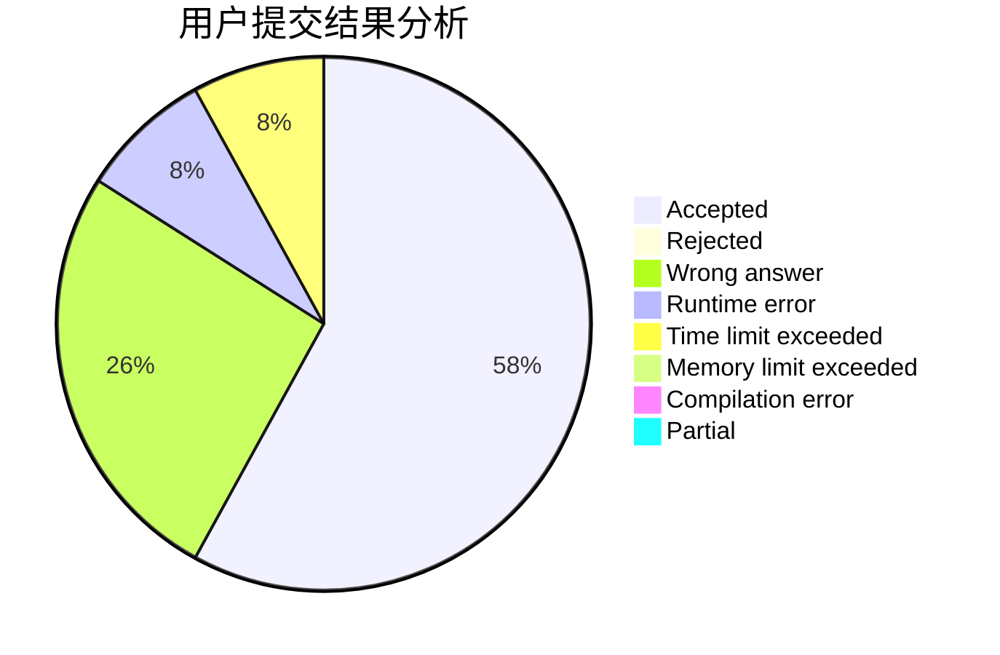
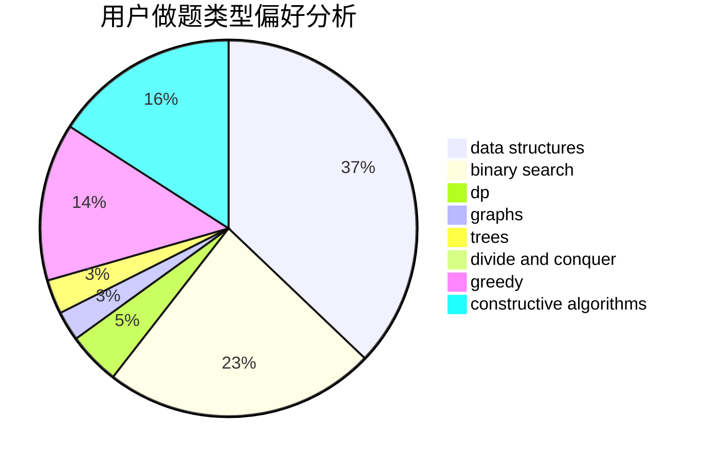
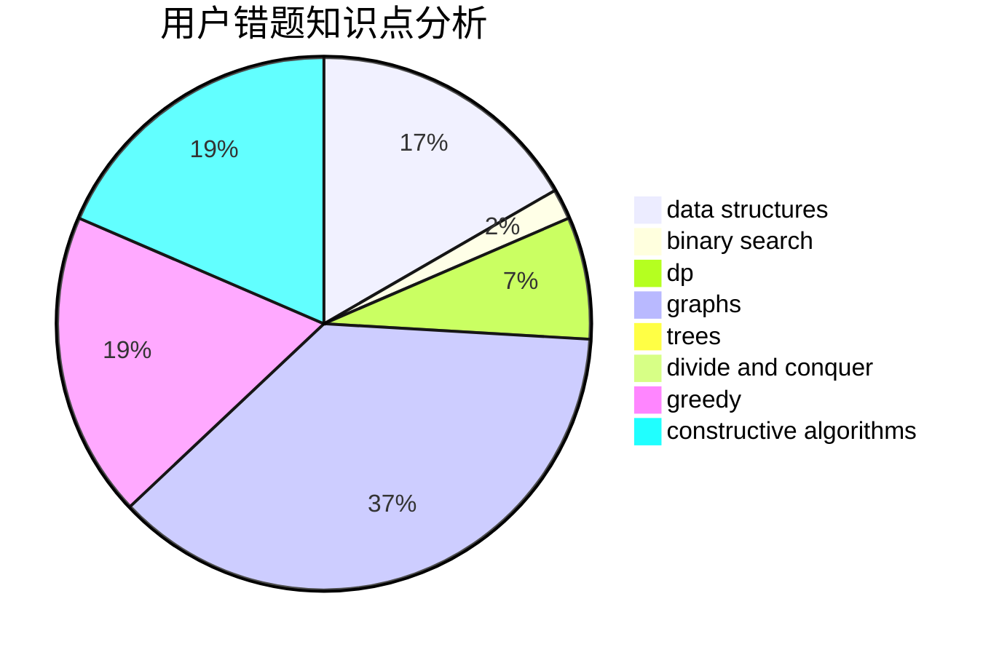

# qx4ever

<!-- tabs:start -->

#### **用户提交结果分析**

#### **用户做题类型偏好分析**

#### **用户错题知识点分析**

<!-- tabs:end -->
# 推荐题目
[215B](https://codeforces.com/contest/215/problem/B)		greedy,
                        math		  
[1468C](https://codeforces.com/contest/1468/problem/C)		data structures,
                        implementation		  
[675A](https://codeforces.com/contest/675/problem/A)		math		  
[651D](https://codeforces.com/contest/651/problem/D)		dsu,graphs,sortings,trees		  
[1339A](https://codeforces.com/contest/1339/problem/A)		brute force,
                        dp,
                        implementation,
                        math		  
[886F](https://codeforces.com/contest/886/problem/F)		geometry		  
[922B](https://codeforces.com/contest/922/problem/B)		brute force		  
[286A](https://codeforces.com/contest/286/problem/A)		constructive algorithms,
                        math		  
[912C](https://codeforces.com/contest/912/problem/C)		brute force,
                        greedy,
                        sortings		  
[748C](https://codeforces.com/contest/748/problem/C)		constructive algorithms,
                        math		  
