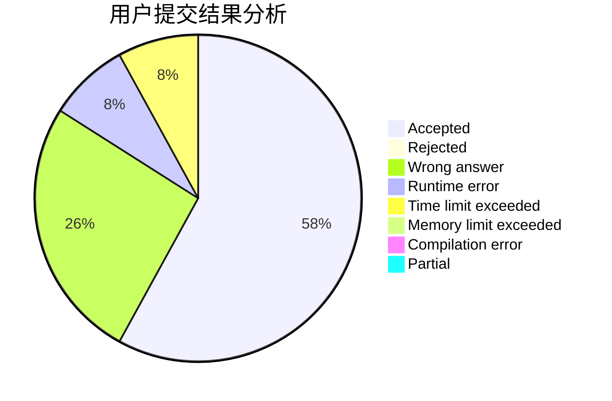
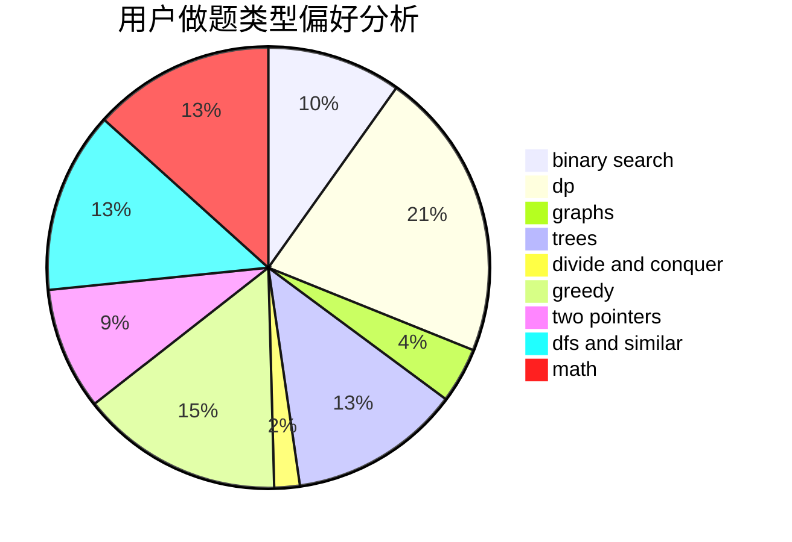

# qx4ever

<!-- tabs:start -->

#### **用户提交结果分析**

#### **用户做题类型偏好分析**

<!-- tabs:end -->
# 推荐题目
[234A](https://codeforces.com/contest/234/problem/A)
[1475D](https://codeforces.com/contest/1475/problem/D)
[69A](https://codeforces.com/contest/69/problem/A)
[675D](https://codeforces.com/contest/675/problem/D)
[1346A](https://codeforces.com/contest/1346/problem/A)
[906A](https://codeforces.com/contest/906/problem/A)
[946B](https://codeforces.com/contest/946/problem/B)
[300B](https://codeforces.com/contest/300/problem/B)
[931A](https://codeforces.com/contest/931/problem/A)
[767D](https://codeforces.com/contest/767/problem/D)
