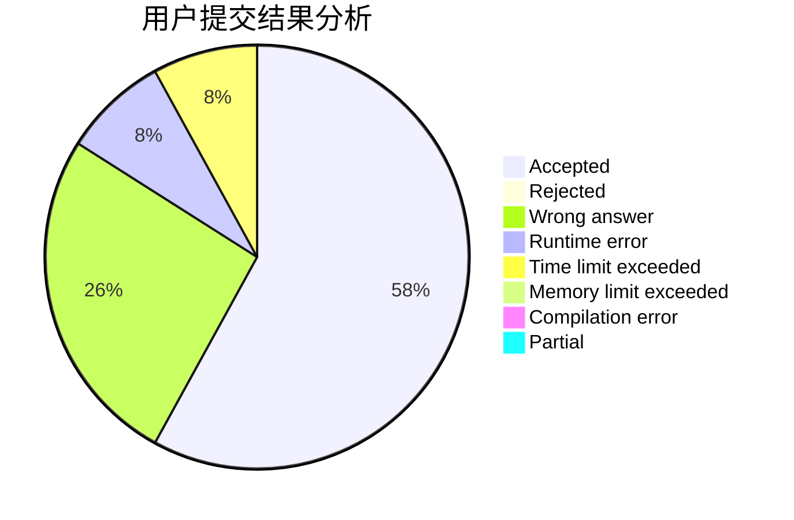
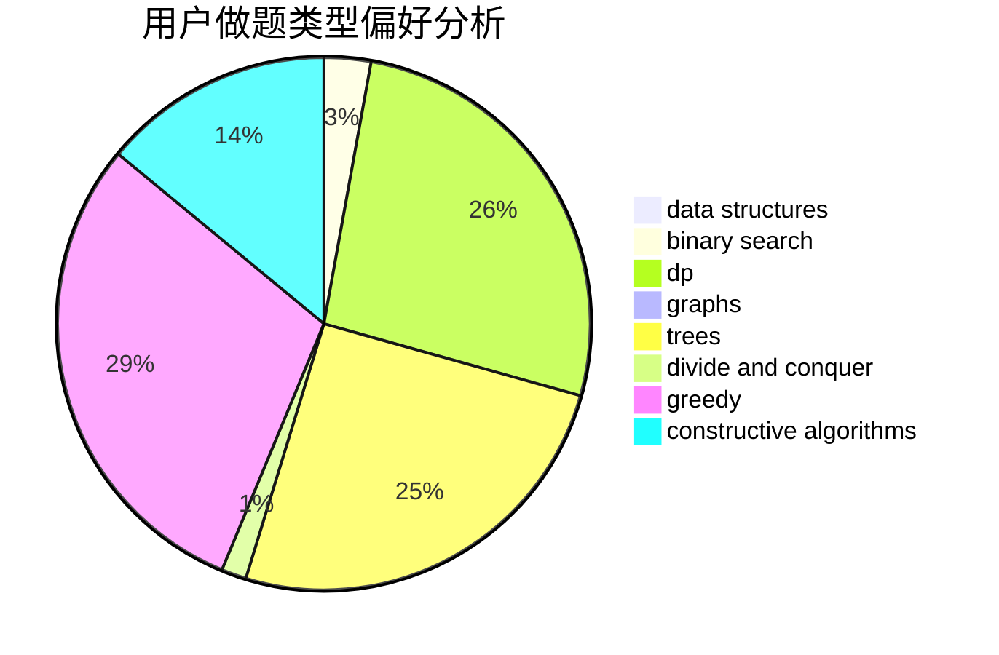
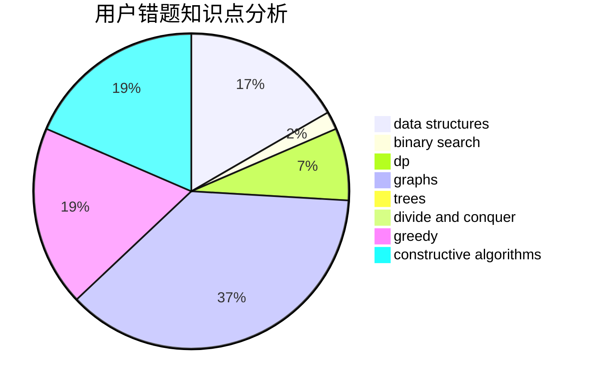

# qx4ever

<!-- tabs:start -->

#### **用户提交结果分析**

#### **用户做题类型偏好分析**

#### **用户错题知识点分析**

<!-- tabs:end -->
# 推荐题目
[234A](https://codeforces.com/contest/234/problem/A)		implementation		  
[1475D](https://codeforces.com/contest/1475/problem/D)		binary search,
                        dp,
                        sortings,
                        two pointers		  
[69A](https://codeforces.com/contest/69/problem/A)		implementation,
                        math		  
[675D](https://codeforces.com/contest/675/problem/D)		data structures,
                        trees		  
[1346A](https://codeforces.com/contest/1346/problem/A)		*special problem,
                        math		  
[906A](https://codeforces.com/contest/906/problem/A)		implementation,
                        strings		  
[946B](https://codeforces.com/contest/946/problem/B)		math,
                        number theory		  
[300B](https://codeforces.com/contest/300/problem/B)		brute force,
                        dfs and similar,
                        graphs		  
[931A](https://codeforces.com/contest/931/problem/A)		brute force,
                        greedy,
                        implementation,
                        math		  
[767D](https://codeforces.com/contest/767/problem/D)		binary search,
                        data structures,
                        greedy,
                        sortings,
                        two pointers		  
