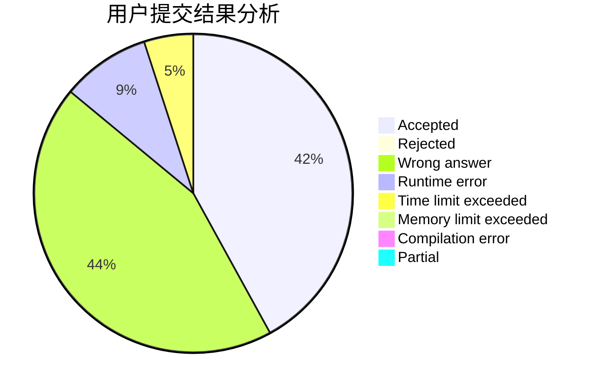
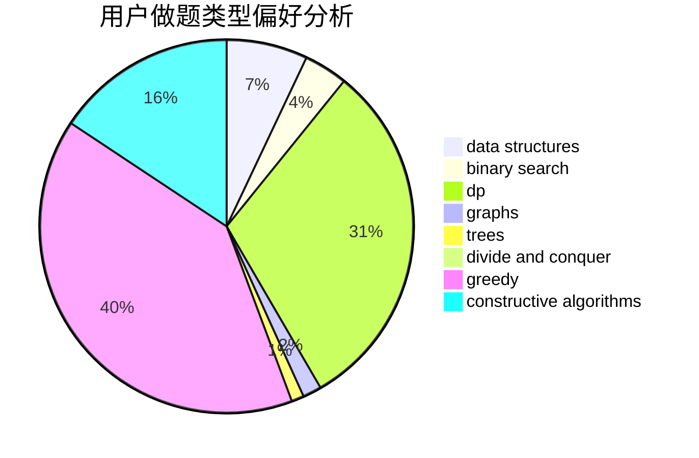
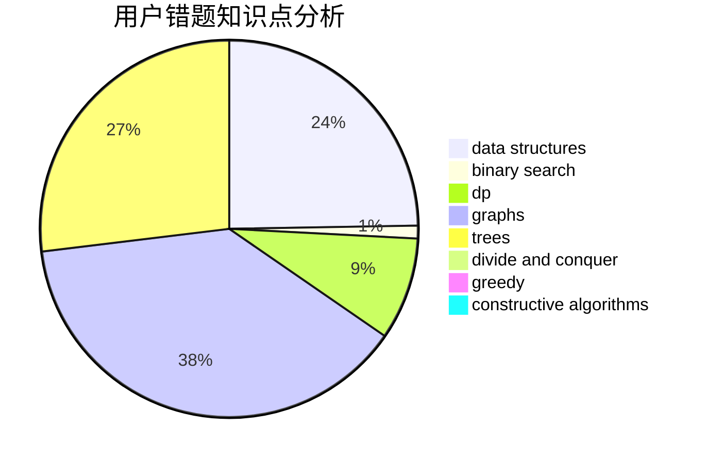

# qxforever

<!-- tabs:start -->

#### **用户提交结果分析**

#### **用户做题类型偏好分析**

#### **用户错题知识点分析**

<!-- tabs:end -->
# 推荐题目
[629D](https://codeforces.com/contest/629/problem/D)		data structures,
                        dp		  
[218C](https://codeforces.com/contest/218/problem/C)		dsu,graphs,sortings,trees		  
[544C](https://codeforces.com/contest/544/problem/C)		dsu,graphs,sortings,trees		  
[711C](https://codeforces.com/contest/711/problem/C)		dp		  
[62E](https://codeforces.com/contest/62/problem/E)		dp,
                        flows		  
[1081D](https://codeforces.com/contest/1081/problem/D)		dsu,
                        graphs,
                        shortest paths,
                        sortings		  
[1482B](https://codeforces.com/contest/1482/problem/B)		implementation,
                        math		  
[987E](https://codeforces.com/contest/987/problem/E)		dsu,graphs,sortings,trees		  
[369C](https://codeforces.com/contest/369/problem/C)		dfs and similar,
                        graphs,
                        trees		  
[704E](https://codeforces.com/contest/704/problem/E)		data structures,
                        geometry,
                        trees		  
