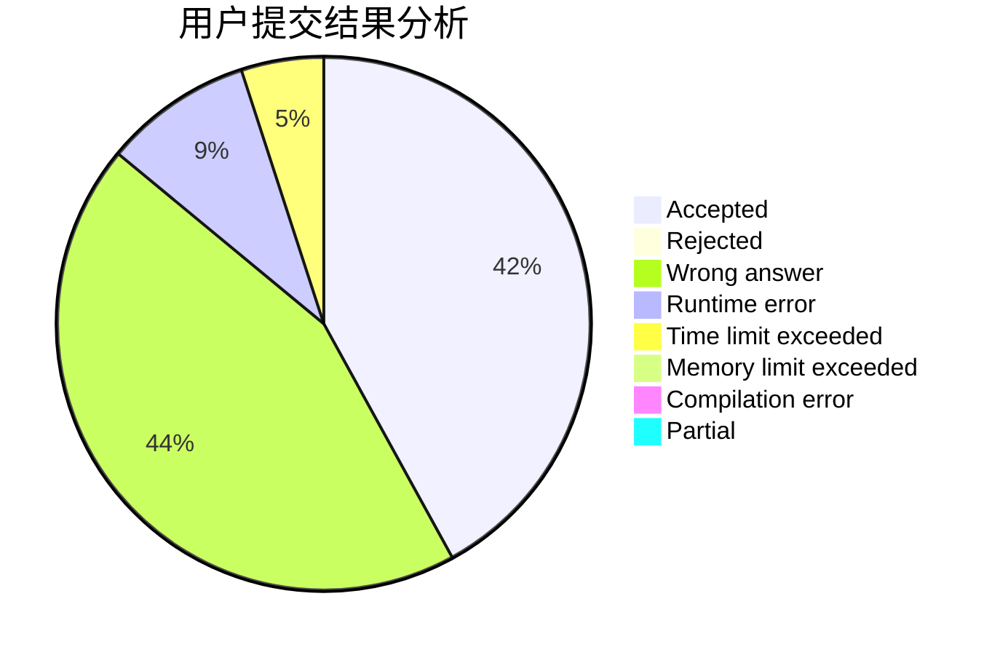
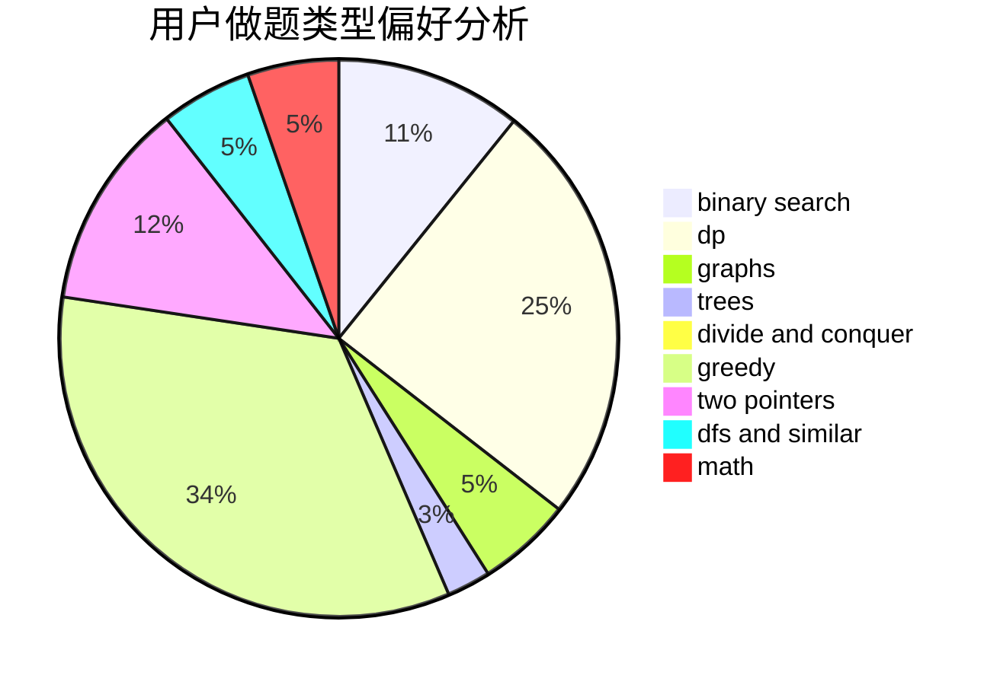

# qxforever

<!-- tabs:start -->

#### **用户提交结果分析**

#### **用户做题类型偏好分析**

<!-- tabs:end -->
# 推荐题目
[629D](https://codeforces.com/contest/629/problem/D)
[218C](https://codeforces.com/contest/218/problem/C)
[544C](https://codeforces.com/contest/544/problem/C)
[711C](https://codeforces.com/contest/711/problem/C)
[62E](https://codeforces.com/contest/62/problem/E)
[1081D](https://codeforces.com/contest/1081/problem/D)
[1482B](https://codeforces.com/contest/1482/problem/B)
[987E](https://codeforces.com/contest/987/problem/E)
[369C](https://codeforces.com/contest/369/problem/C)
[704E](https://codeforces.com/contest/704/problem/E)
