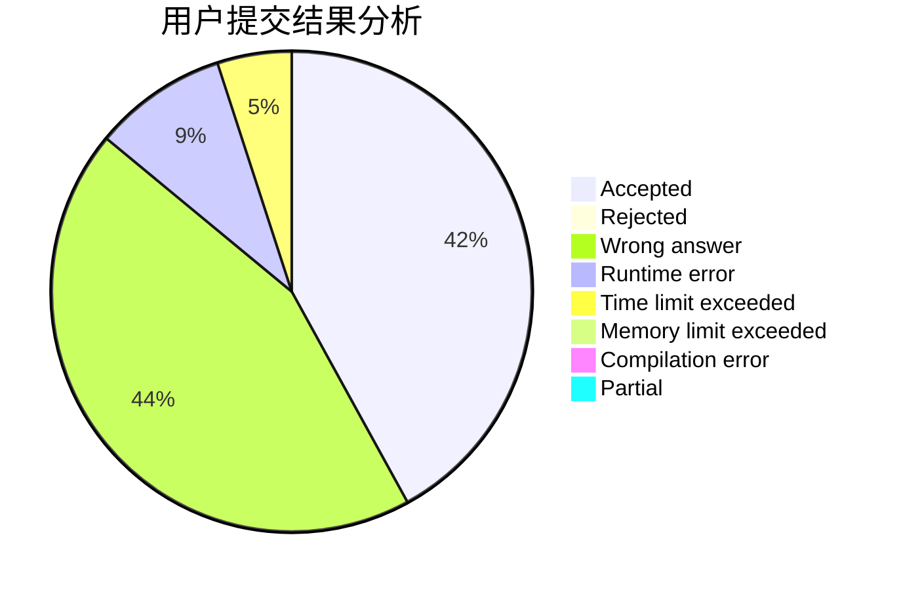
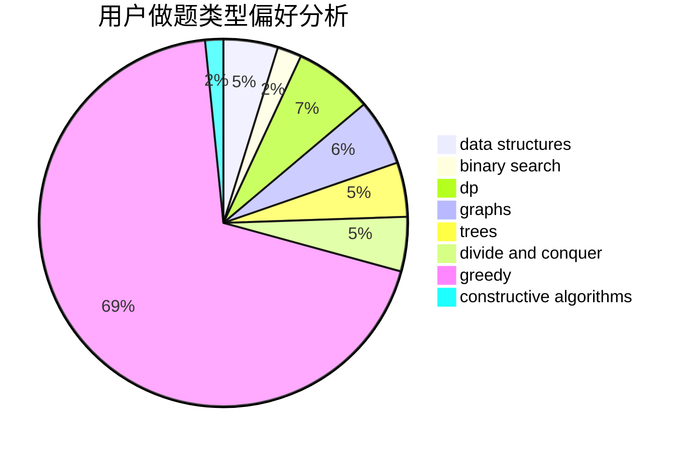
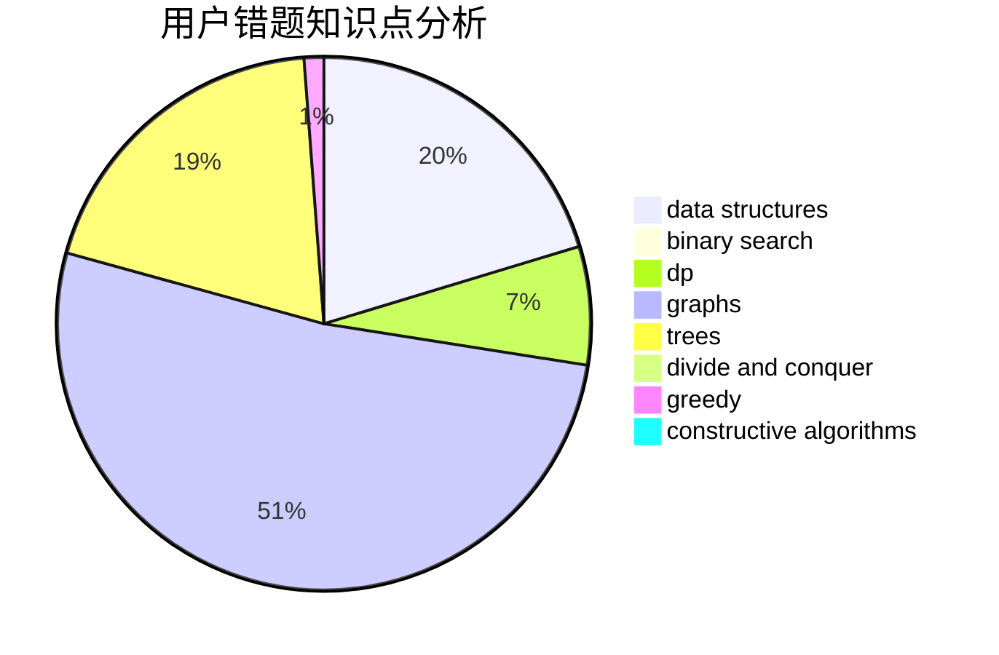

# qxforever

<!-- tabs:start -->

#### **用户提交结果分析**

#### **用户做题类型偏好分析**

#### **用户错题知识点分析**

<!-- tabs:end -->
# 推荐题目
[610B](https://codeforces.com/contest/610/problem/B)		constructive algorithms,
                        implementation		  
[195C](https://codeforces.com/contest/195/problem/C)		expression parsing,
                        implementation		  
[518F](https://codeforces.com/contest/518/problem/F)		binary search,
                        brute force,
                        combinatorics,
                        dp,
                        implementation		  
[691E](https://codeforces.com/contest/691/problem/E)		matrices		  
[610E](https://codeforces.com/contest/610/problem/E)		data structures,
                        strings		  
[1081A](https://codeforces.com/contest/1081/problem/A)		constructive algorithms,
                        math		  
[1473E](https://codeforces.com/contest/1473/problem/E)		graphs,
                        shortest paths		  
[965E](https://codeforces.com/contest/965/problem/E)		data structures,
                        dp,
                        greedy,
                        strings,
                        trees		  
[342C](https://codeforces.com/contest/342/problem/C)		geometry		  
[681A](https://codeforces.com/contest/681/problem/A)		implementation		  
