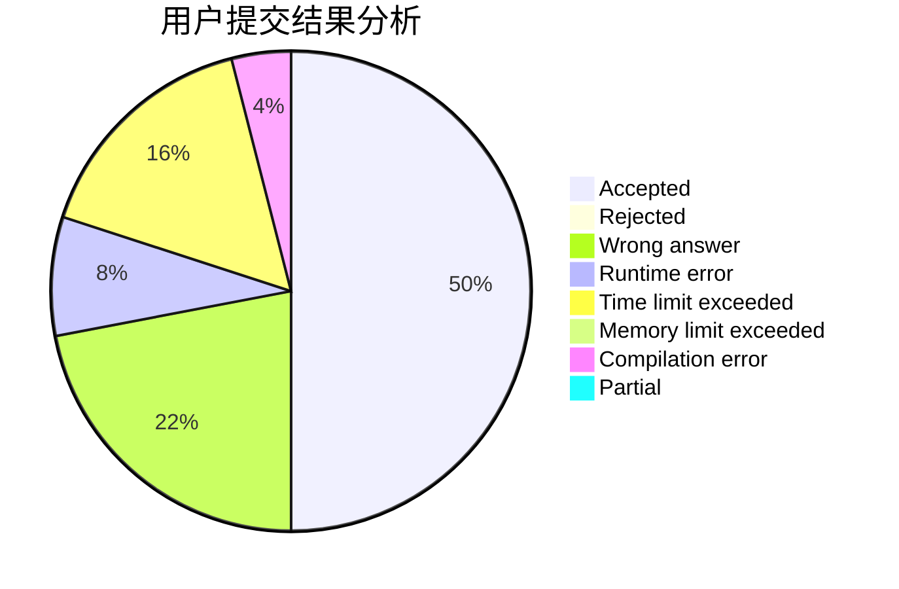
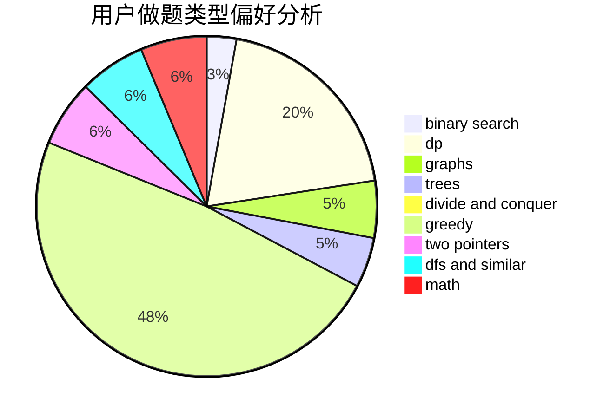

# qxp

<!-- tabs:start -->

#### **用户提交结果分析**

#### **用户做题类型偏好分析**

<!-- tabs:end -->
# 推荐题目
[19A](https://codeforces.com/contest/19/problem/A)
[364A](https://codeforces.com/contest/364/problem/A)
[935F](https://codeforces.com/contest/935/problem/F)
[297C](https://codeforces.com/contest/297/problem/C)
[1156F](https://codeforces.com/contest/1156/problem/F)
[1025E](https://codeforces.com/contest/1025/problem/E)
[1197A](https://codeforces.com/contest/1197/problem/A)
[293B](https://codeforces.com/contest/293/problem/B)
[1343B](https://codeforces.com/contest/1343/problem/B)
[1381D](https://codeforces.com/contest/1381/problem/D)
