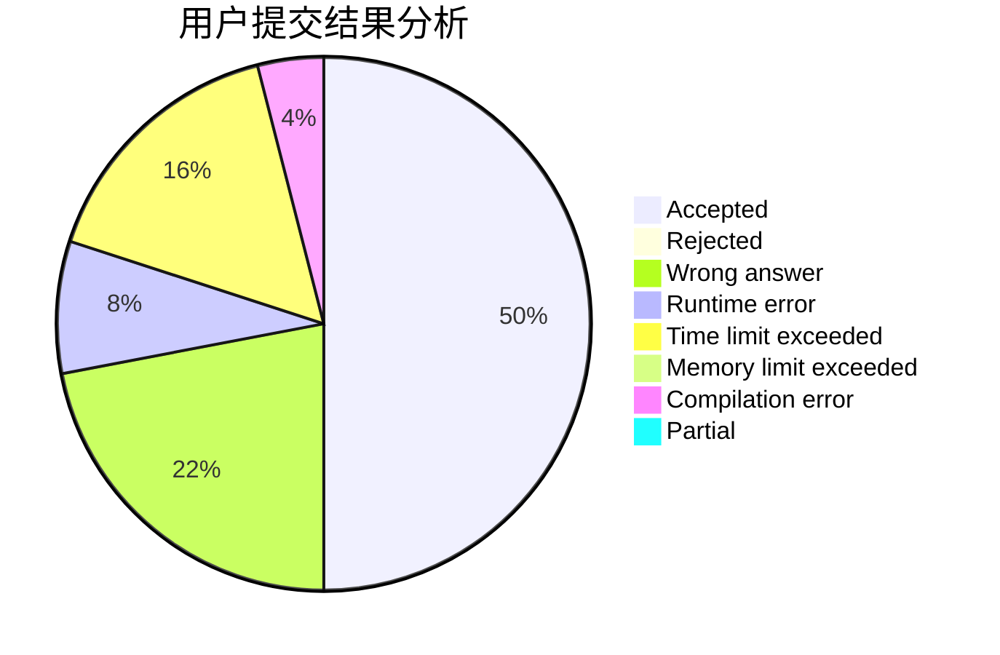
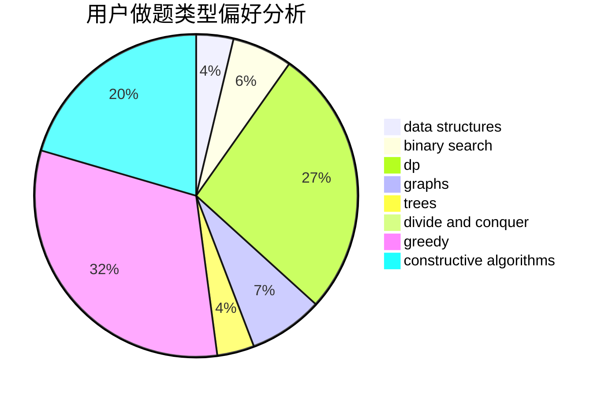
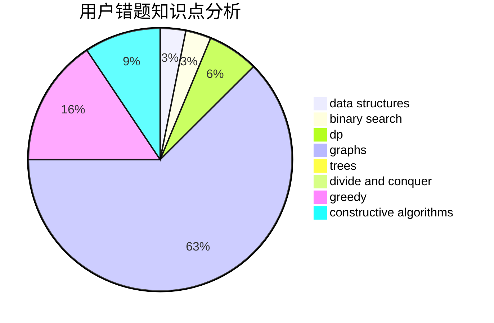

# qxp

<!-- tabs:start -->

#### **用户提交结果分析**

#### **用户做题类型偏好分析**

#### **用户错题知识点分析**

<!-- tabs:end -->
# 推荐题目
[19A](https://codeforces.com/contest/19/problem/A)		implementation		  
[364A](https://codeforces.com/contest/364/problem/A)		combinatorics,
                        data structures,
                        implementation		  
[935F](https://codeforces.com/contest/935/problem/F)		data structures,
                        greedy		  
[297C](https://codeforces.com/contest/297/problem/C)		constructive algorithms		  
[1156F](https://codeforces.com/contest/1156/problem/F)		dp,
                        math,
                        probabilities		  
[1025E](https://codeforces.com/contest/1025/problem/E)		constructive algorithms,
                        implementation,
                        matrices		  
[1197A](https://codeforces.com/contest/1197/problem/A)		greedy,
                        math,
                        sortings		  
[293B](https://codeforces.com/contest/293/problem/B)		brute force,
                        combinatorics		  
[1343B](https://codeforces.com/contest/1343/problem/B)		constructive algorithms,
                        math		  
[1381D](https://codeforces.com/contest/1381/problem/D)		dfs and similar,
                        dp,
                        greedy,
                        trees,
                        two pointers		  
