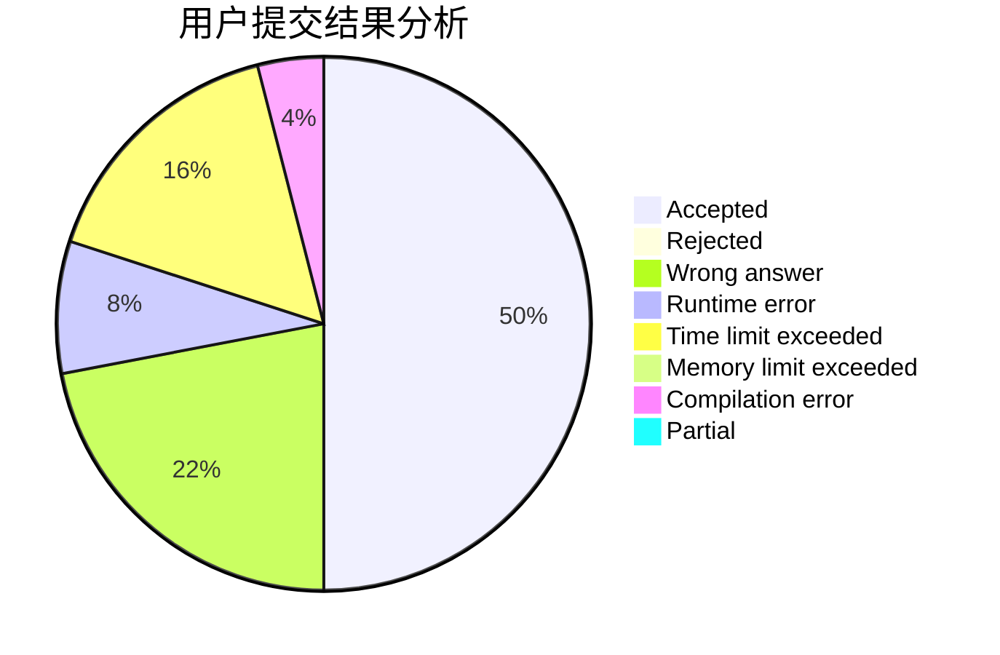
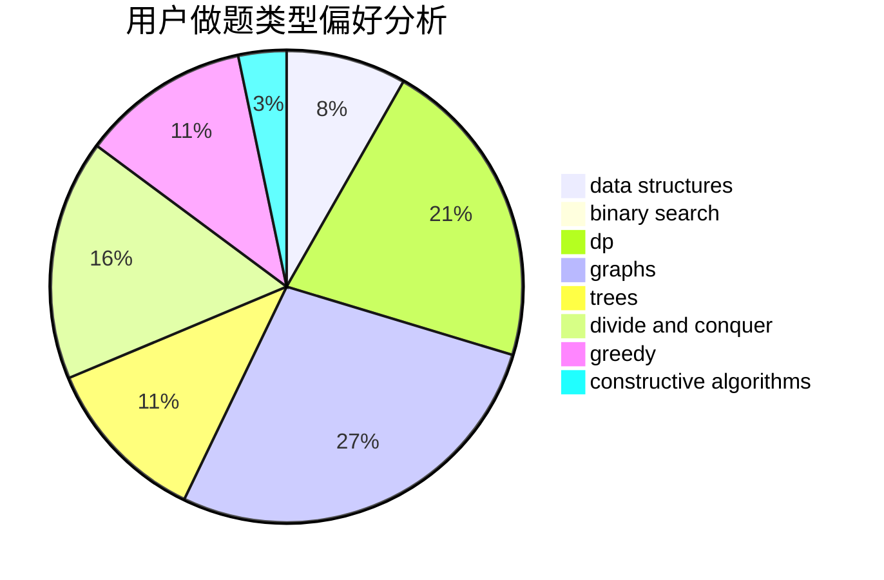
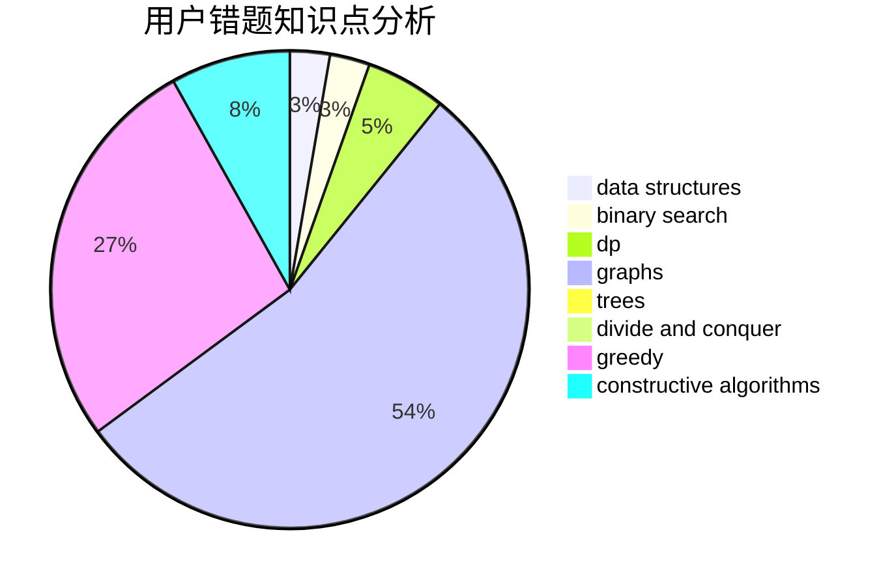

# qxp

<!-- tabs:start -->

#### **用户提交结果分析**

#### **用户做题类型偏好分析**

#### **用户错题知识点分析**

<!-- tabs:end -->
# 推荐题目
[171H](https://codeforces.com/contest/171/problem/H)		*special problem,
                        implementation		  
[337C](https://codeforces.com/contest/337/problem/C)		binary search,
                        greedy,
                        math,
                        matrices,
                        number theory		  
[915G](https://codeforces.com/contest/915/problem/G)		math,
                        number theory		  
[281A](https://codeforces.com/contest/281/problem/A)		implementation,
                        strings		  
[1154F](https://codeforces.com/contest/1154/problem/F)		dp,
                        greedy,
                        sortings		  
[1025B](https://codeforces.com/contest/1025/problem/B)		brute force,
                        greedy,
                        number theory		  
[1191B](https://codeforces.com/contest/1191/problem/B)		brute force,
                        implementation		  
[278B](https://codeforces.com/contest/278/problem/B)		brute force,
                        strings		  
[1336A](https://codeforces.com/contest/1336/problem/A)		dfs and similar,
                        dp,
                        greedy,
                        sortings,
                        trees		  
[1373A](https://codeforces.com/contest/1373/problem/A)		greedy,
                        implementation,
                        math		  
