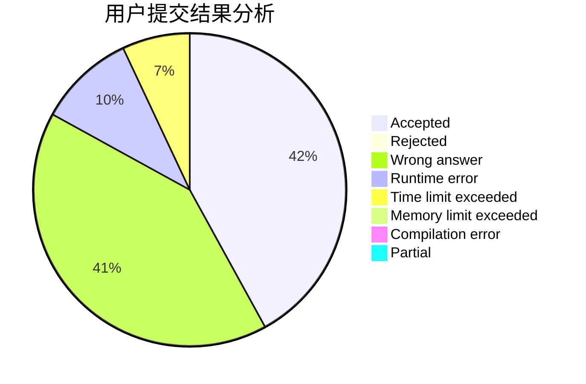
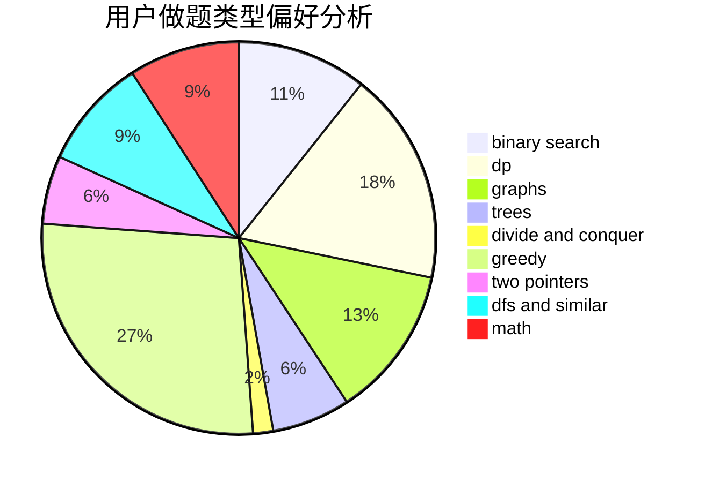

# C20193515_LYX

<!-- tabs:start -->

#### **用户提交结果分析**

#### **用户做题类型偏好分析**

<!-- tabs:end -->
# 推荐题目
[604B](https://codeforces.com/contest/604/problem/B)
[1194D](https://codeforces.com/contest/1194/problem/D)
[603B](https://codeforces.com/contest/603/problem/B)
[176B](https://codeforces.com/contest/176/problem/B)
[1146A](https://codeforces.com/contest/1146/problem/A)
[1395A](https://codeforces.com/contest/1395/problem/A)
[229D](https://codeforces.com/contest/229/problem/D)
[11412](https://codeforces.com/contest/1141/problem/2)
[131A](https://codeforces.com/contest/131/problem/A)
[603E](https://codeforces.com/contest/603/problem/E)
