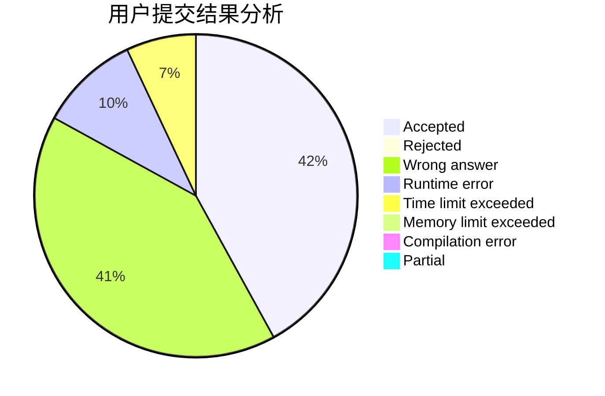
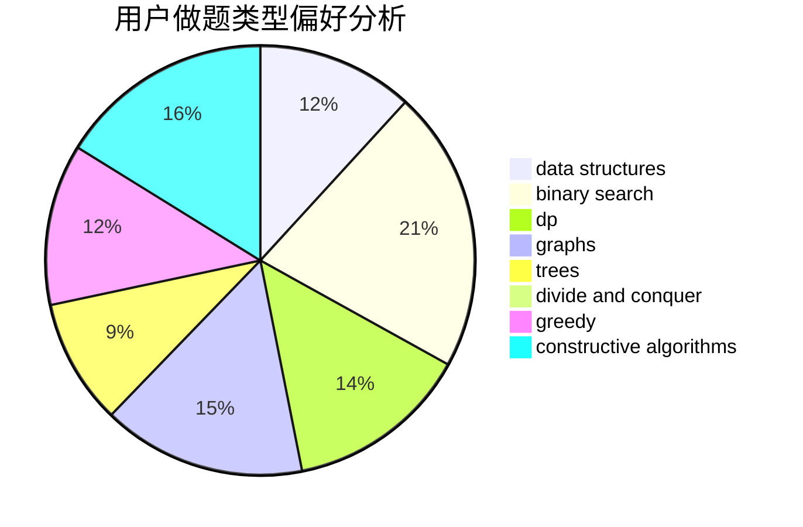
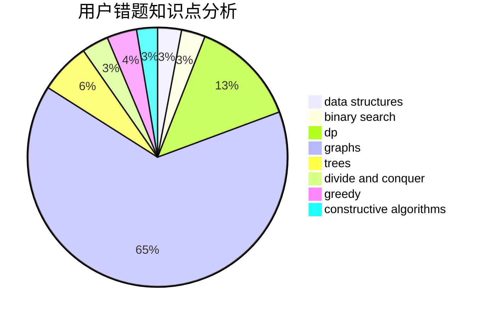

# C20193515_LYX

<!-- tabs:start -->

#### **用户提交结果分析**

#### **用户做题类型偏好分析**

#### **用户错题知识点分析**

<!-- tabs:end -->
# 推荐题目
[584B](https://codeforces.com/contest/584/problem/B)		combinatorics		  
[1189B](https://codeforces.com/contest/1189/problem/B)		greedy,
                        math,
                        sortings		  
[582B](https://codeforces.com/contest/582/problem/B)		constructive algorithms,
                        dp,
                        matrices		  
[154C](https://codeforces.com/contest/154/problem/C)		graphs,
                        hashing,
                        sortings		  
[1143F](https://codeforces.com/contest/1143/problem/F)		dsu,graphs,sortings,trees		  
[1385A](https://codeforces.com/contest/1385/problem/A)		math		  
[205B](https://codeforces.com/contest/205/problem/B)		brute force,
                        greedy		  
[1139E](https://codeforces.com/contest/1139/problem/E)		flows,
                        graph matchings,
                        graphs		  
[1310D](https://codeforces.com/contest/1310/problem/D)		dp,
                        graphs,
                        probabilities		  
[582D](https://codeforces.com/contest/582/problem/D)		dp,
                        math,
                        number theory		  
