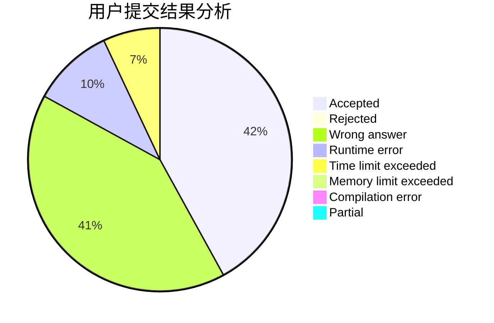
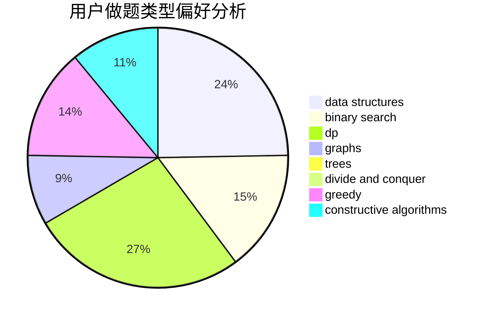
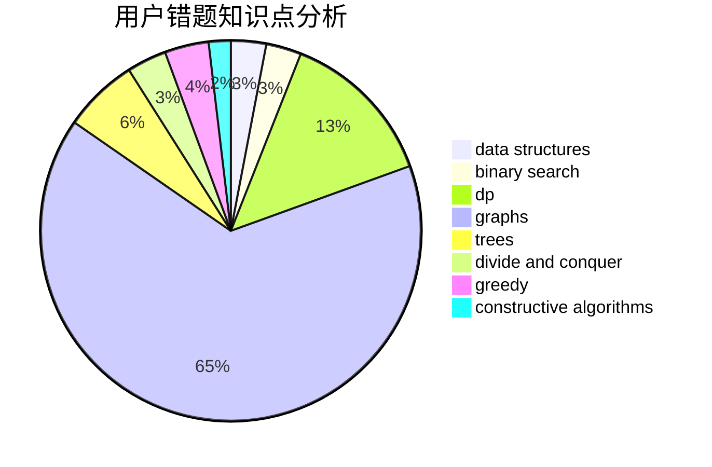

# C20193515_LYX

<!-- tabs:start -->

#### **用户提交结果分析**

#### **用户做题类型偏好分析**

#### **用户错题知识点分析**

<!-- tabs:end -->
# 推荐题目
[604B](https://codeforces.com/contest/604/problem/B)		binary search,
                        greedy		  
[1194D](https://codeforces.com/contest/1194/problem/D)		games,
                        math		  
[603B](https://codeforces.com/contest/603/problem/B)		combinatorics,
                        dfs and similar,
                        dsu,
                        math,
                        number theory		  
[176B](https://codeforces.com/contest/176/problem/B)		dp		  
[1146A](https://codeforces.com/contest/1146/problem/A)		implementation,
                        strings		  
[1395A](https://codeforces.com/contest/1395/problem/A)		brute force,
                        math		  
[229D](https://codeforces.com/contest/229/problem/D)		dp,
                        greedy,
                        two pointers		  
[11412](https://codeforces.com/contest/1141/problem/2)		dsu,graphs,sortings,trees		  
[131A](https://codeforces.com/contest/131/problem/A)		implementation,
                        strings		  
[603E](https://codeforces.com/contest/603/problem/E)		data structures,
                        divide and conquer,
                        dsu,
                        math,
                        trees		  
