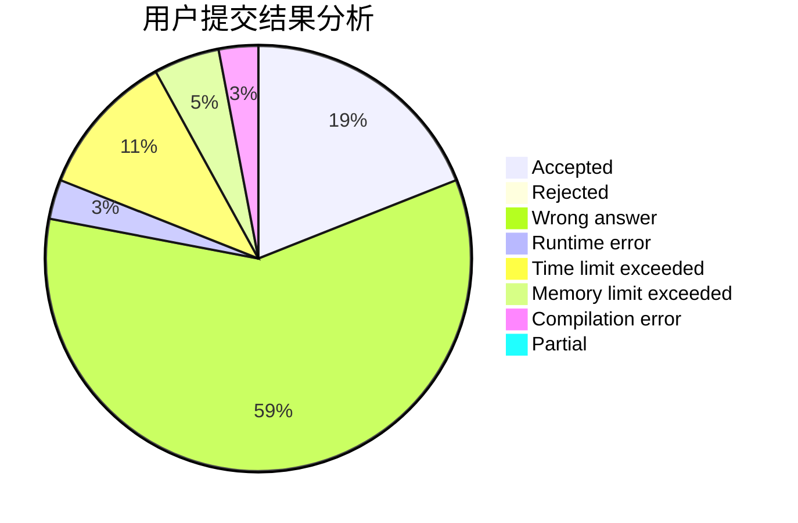
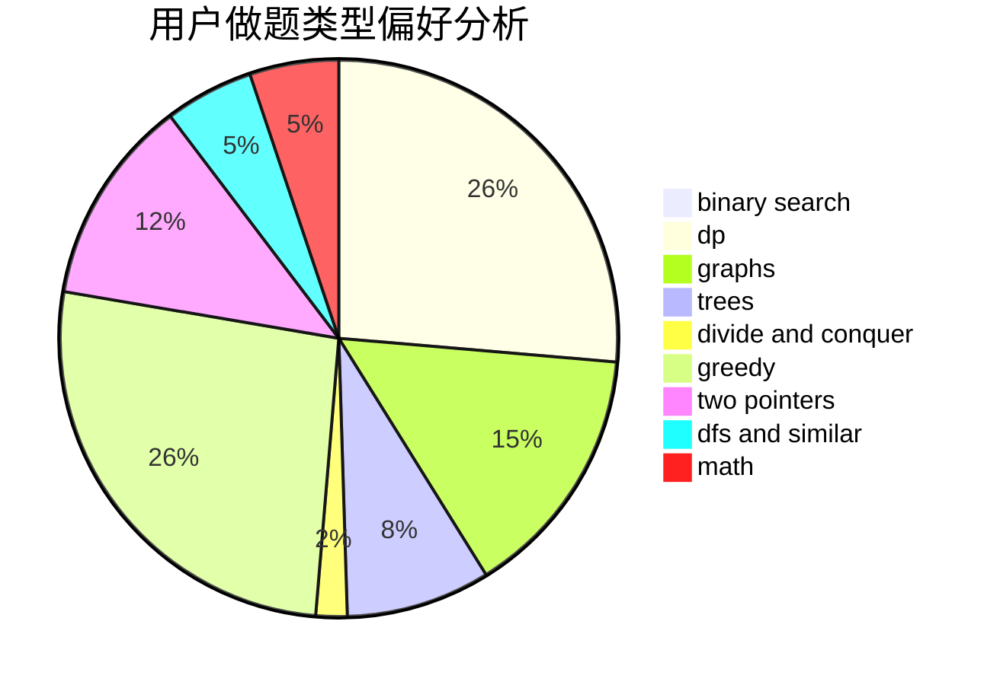

# qyj060604

<!-- tabs:start -->

#### **用户提交结果分析**

#### **用户做题类型偏好分析**

<!-- tabs:end -->
# 推荐题目
[220C](https://codeforces.com/contest/220/problem/C)
[766D](https://codeforces.com/contest/766/problem/D)
[996B](https://codeforces.com/contest/996/problem/B)
[243C](https://codeforces.com/contest/243/problem/C)
[660B](https://codeforces.com/contest/660/problem/B)
[611C](https://codeforces.com/contest/611/problem/C)
[12272](https://codeforces.com/contest/1227/problem/2)
[868E](https://codeforces.com/contest/868/problem/E)
[1387A](https://codeforces.com/contest/1387/problem/A)
[699B](https://codeforces.com/contest/699/problem/B)
