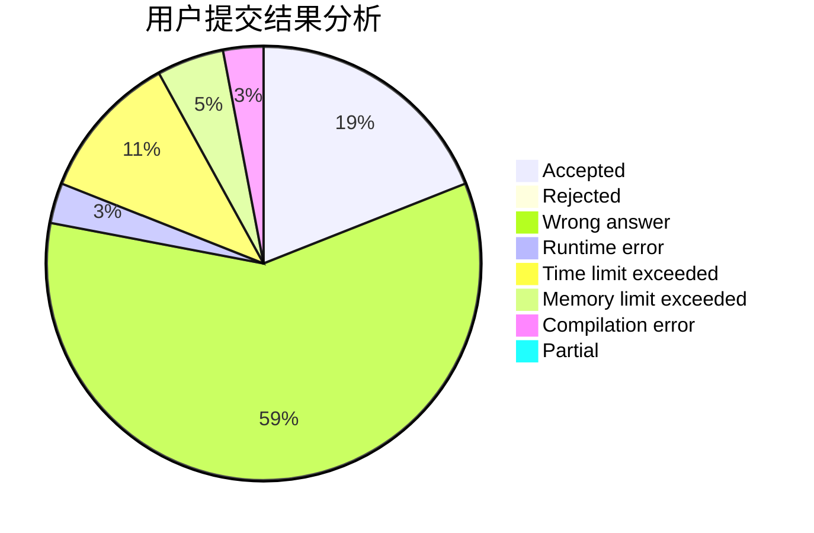
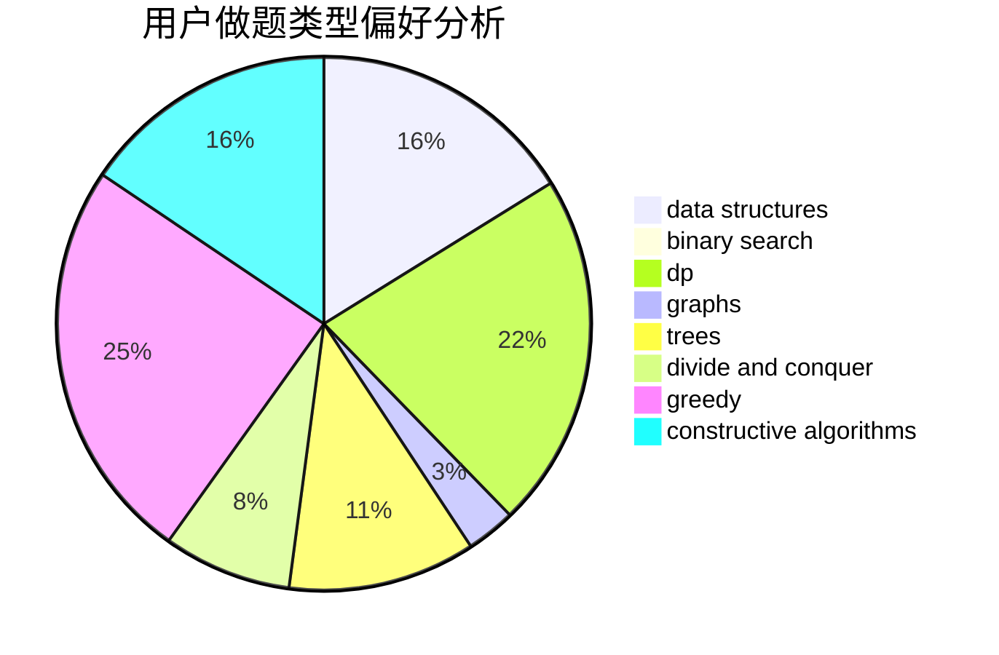

# qyj060604

<!-- tabs:start -->

#### **用户提交结果分析**

#### **用户做题类型偏好分析**

#### **用户错题知识点分析**

<!-- tabs:end -->
# 推荐题目
[220C](https://codeforces.com/contest/220/problem/C)		data structures		  
[766D](https://codeforces.com/contest/766/problem/D)		data structures,
                        dfs and similar,
                        dp,
                        dsu,
                        graphs		  
[996B](https://codeforces.com/contest/996/problem/B)		binary search,
                        math		  
[243C](https://codeforces.com/contest/243/problem/C)		dfs and similar,
                        implementation		  
[660B](https://codeforces.com/contest/660/problem/B)		implementation		  
[611C](https://codeforces.com/contest/611/problem/C)		dp,
                        implementation		  
[12272](https://codeforces.com/contest/1227/problem/2)		dsu,graphs,sortings,trees		  
[868E](https://codeforces.com/contest/868/problem/E)		dp,
                        graphs,
                        trees		  
[1387A](https://codeforces.com/contest/1387/problem/A)		*special problem,
                        binary search,
                        dfs and similar,
                        dp,
                        math,
                        ternary search		  
[699B](https://codeforces.com/contest/699/problem/B)		implementation		  
