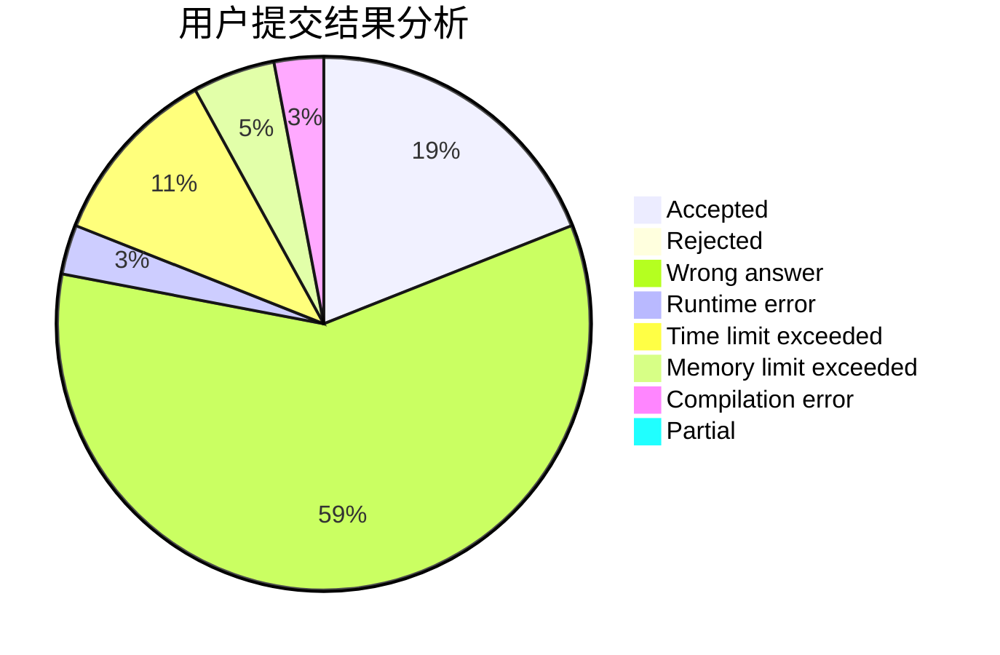
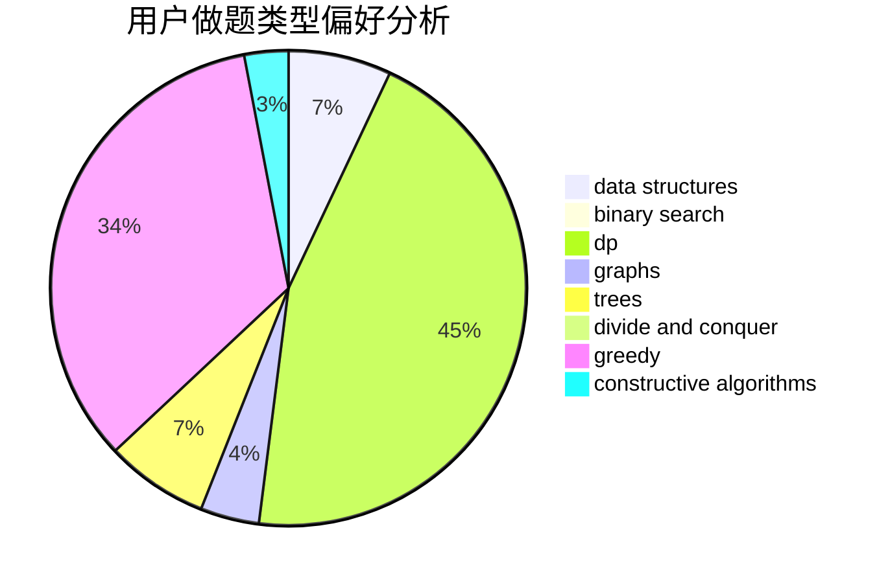

# qyj060604

<!-- tabs:start -->

#### **用户提交结果分析**

#### **用户做题类型偏好分析**

#### **用户错题知识点分析**

<!-- tabs:end -->
# 推荐题目
[199D](https://codeforces.com/contest/199/problem/D)		dsu,graphs,sortings,trees		  
[747A](https://codeforces.com/contest/747/problem/A)		brute force,
                        math		  
[981A](https://codeforces.com/contest/981/problem/A)		brute force,
                        implementation,
                        strings		  
[225C](https://codeforces.com/contest/225/problem/C)		dp,
                        matrices		  
[630F](https://codeforces.com/contest/630/problem/F)		combinatorics,
                        math		  
[592A](https://codeforces.com/contest/592/problem/A)		implementation		  
[1219C](https://codeforces.com/contest/1219/problem/C)		implementation,
                        strings		  
[84A](https://codeforces.com/contest/84/problem/A)		math,
                        number theory		  
[1378A2](https://codeforces.com/contest/1378A/problem/2)		dsu,graphs,sortings,trees		  
[674D](https://codeforces.com/contest/674/problem/D)		dsu,graphs,sortings,trees		  
