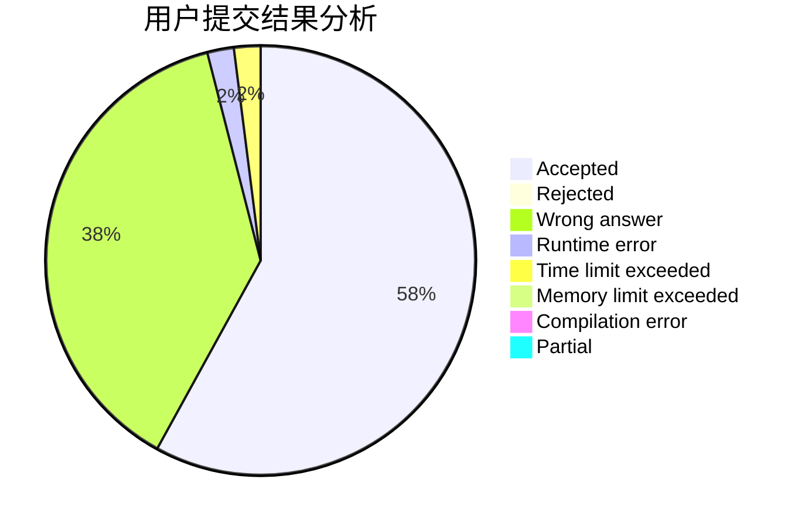
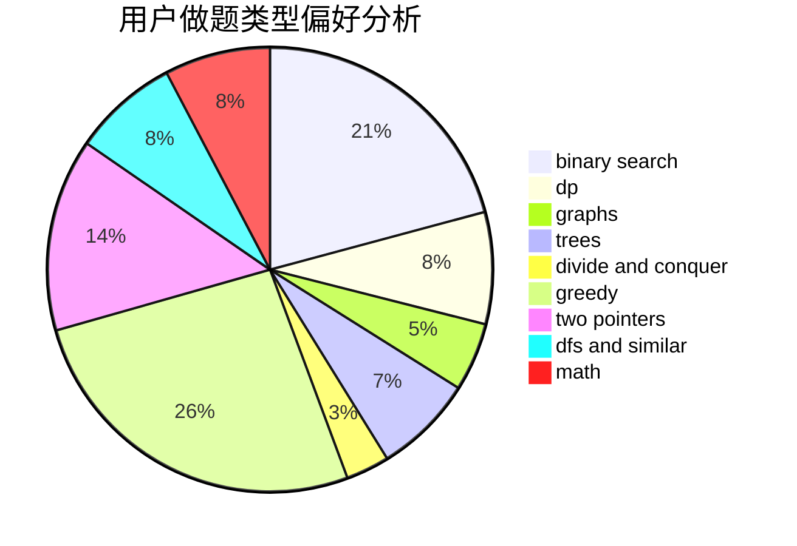

# qzxakioi

<!-- tabs:start -->

#### **用户提交结果分析**

#### **用户做题类型偏好分析**

<!-- tabs:end -->
# 推荐题目
[600D](https://codeforces.com/contest/600/problem/D)
[650B](https://codeforces.com/contest/650/problem/B)
[984A](https://codeforces.com/contest/984/problem/A)
[1085F](https://codeforces.com/contest/1085/problem/F)
[784D](https://codeforces.com/contest/784/problem/D)
[77E](https://codeforces.com/contest/77/problem/E)
[11781](https://codeforces.com/contest/1178/problem/1)
[804B](https://codeforces.com/contest/804/problem/B)
[900A](https://codeforces.com/contest/900/problem/A)
[372D](https://codeforces.com/contest/372/problem/D)
