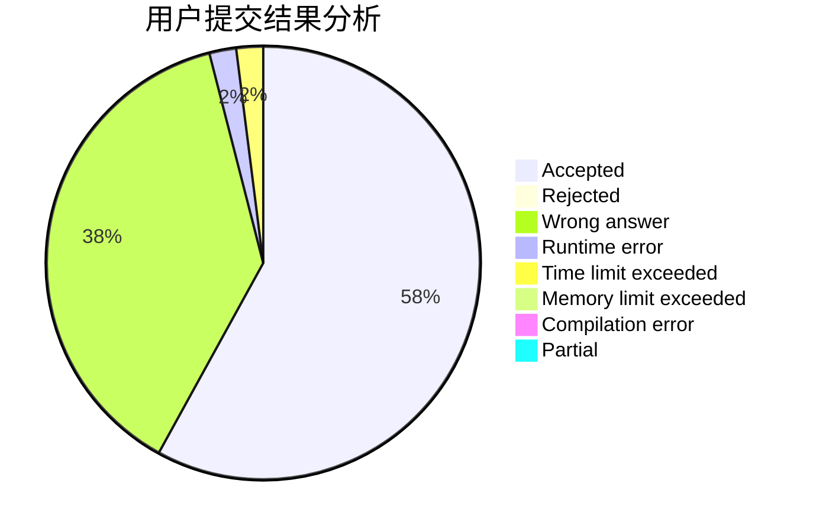
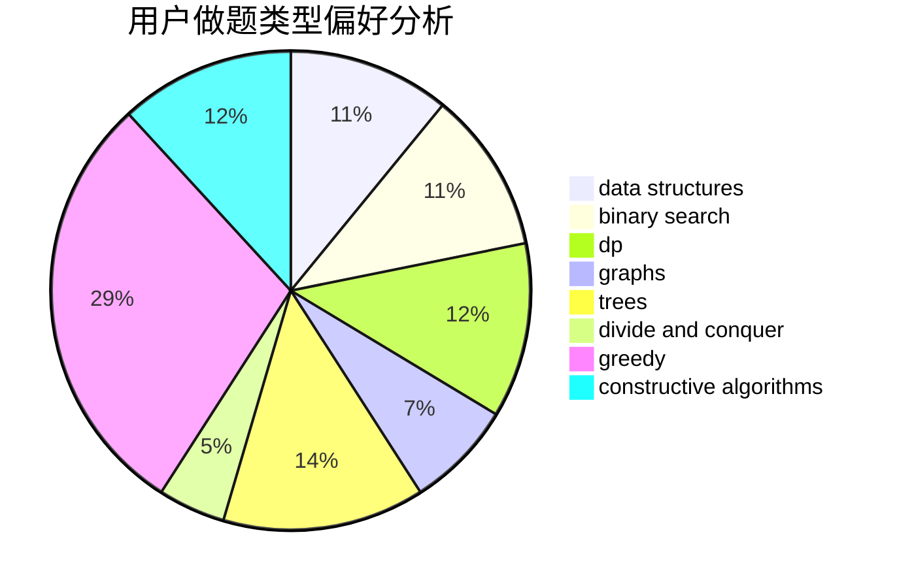
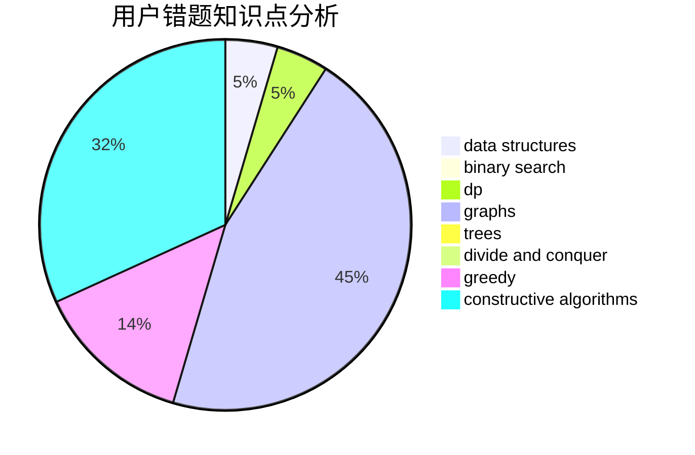

# qzxakioi

<!-- tabs:start -->

#### **用户提交结果分析**

#### **用户做题类型偏好分析**

#### **用户错题知识点分析**

<!-- tabs:end -->
# 推荐题目
[600D](https://codeforces.com/contest/600/problem/D)		geometry		  
[650B](https://codeforces.com/contest/650/problem/B)		binary search,
                        brute force,
                        dp,
                        two pointers		  
[984A](https://codeforces.com/contest/984/problem/A)		sortings		  
[1085F](https://codeforces.com/contest/1085/problem/F)		nan		  
[784D](https://codeforces.com/contest/784/problem/D)		*special problem,
                        implementation		  
[77E](https://codeforces.com/contest/77/problem/E)		geometry		  
[11781](https://codeforces.com/contest/1178/problem/1)		dsu,graphs,sortings,trees		  
[804B](https://codeforces.com/contest/804/problem/B)		combinatorics,
                        greedy,
                        implementation,
                        math		  
[900A](https://codeforces.com/contest/900/problem/A)		geometry,
                        implementation		  
[372D](https://codeforces.com/contest/372/problem/D)		binary search,
                        data structures,
                        dfs and similar,
                        trees,
                        two pointers		  
