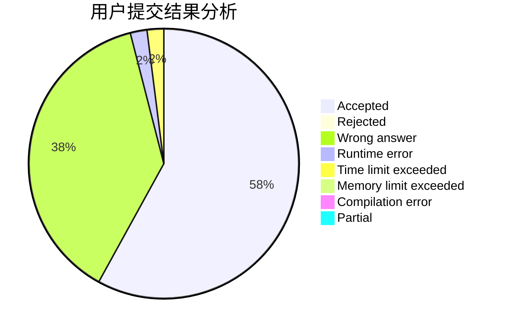
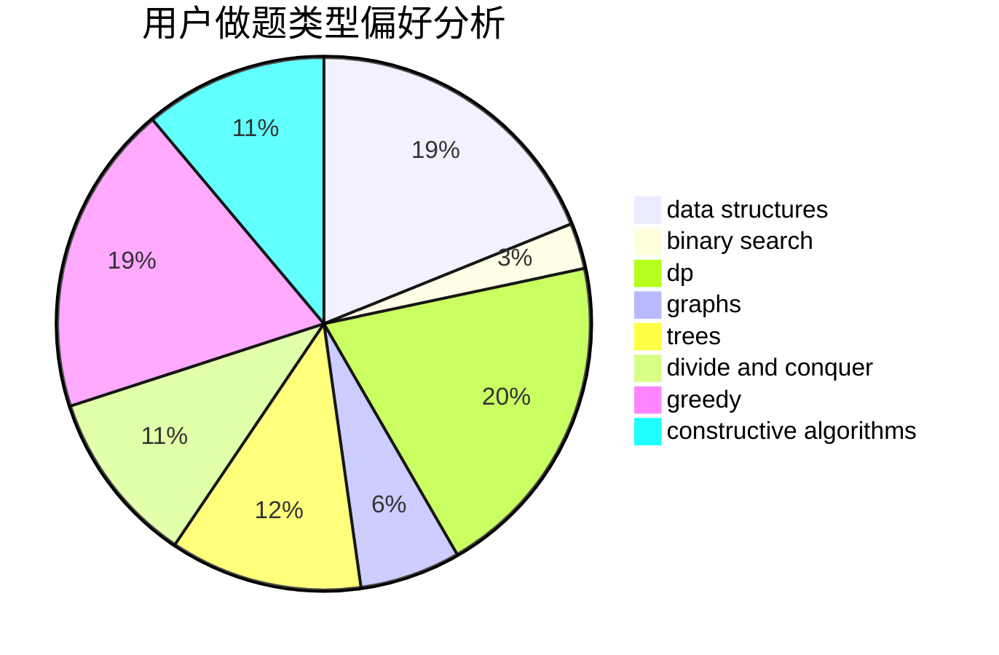
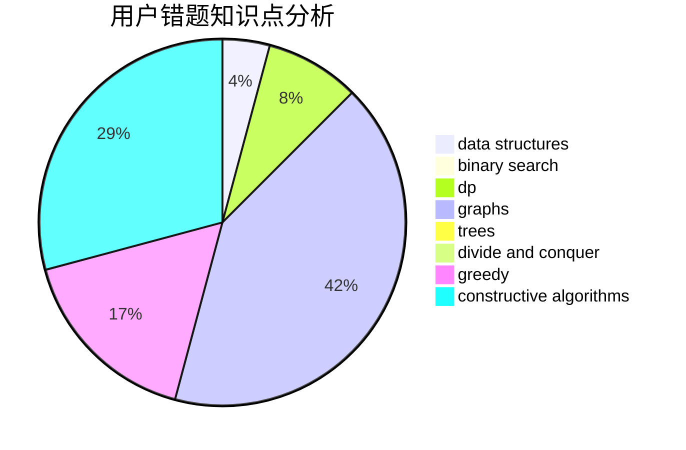

# qzxakioi

<!-- tabs:start -->

#### **用户提交结果分析**

#### **用户做题类型偏好分析**

#### **用户错题知识点分析**

<!-- tabs:end -->
# 推荐题目
[580B](https://codeforces.com/contest/580/problem/B)		binary search,
                        sortings,
                        two pointers		  
[622B](https://codeforces.com/contest/622/problem/B)		implementation		  
[961E](https://codeforces.com/contest/961/problem/E)		data structures		  
[1085A](https://codeforces.com/contest/1085/problem/A)		implementation,
                        strings		  
[765A](https://codeforces.com/contest/765/problem/A)		implementation,
                        math		  
[760A](https://codeforces.com/contest/760/problem/A)		implementation,
                        math		  
[1174E](https://codeforces.com/contest/1174/problem/E)		combinatorics,
                        dp,
                        math,
                        number theory		  
[788E](https://codeforces.com/contest/788/problem/E)		data structures		  
[883B](https://codeforces.com/contest/883/problem/B)		constructive algorithms,
                        graphs,
                        greedy		  
[348A](https://codeforces.com/contest/348/problem/A)		binary search,
                        math,
                        sortings		  
