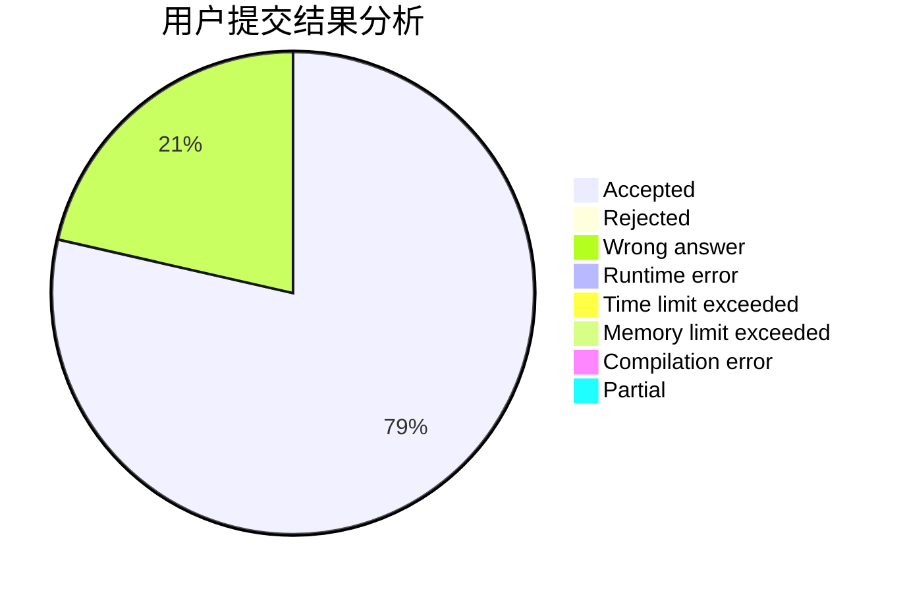
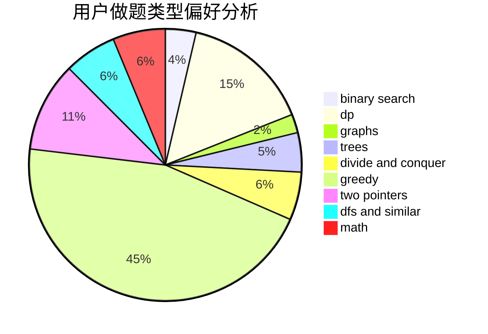

# r0wHa0

<!-- tabs:start -->

#### **用户提交结果分析**

#### **用户做题类型偏好分析**

<!-- tabs:end -->
# 推荐题目
[1157E](https://codeforces.com/contest/1157/problem/E)
[982D](https://codeforces.com/contest/982/problem/D)
[1432A](https://codeforces.com/contest/1432/problem/A)
[797C](https://codeforces.com/contest/797/problem/C)
[764C](https://codeforces.com/contest/764/problem/C)
[441C](https://codeforces.com/contest/441/problem/C)
[1086B](https://codeforces.com/contest/1086/problem/B)
[299C](https://codeforces.com/contest/299/problem/C)
[11951](https://codeforces.com/contest/1195/problem/1)
[604C](https://codeforces.com/contest/604/problem/C)
