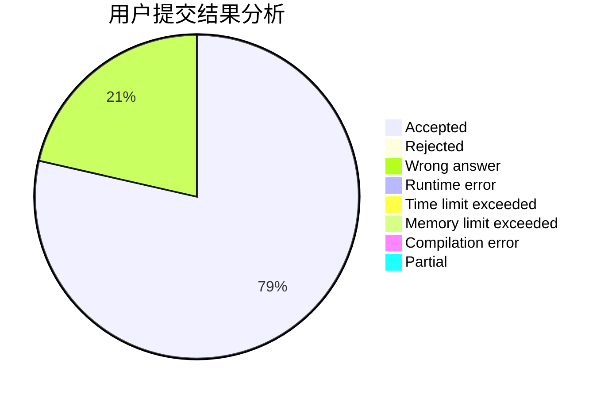
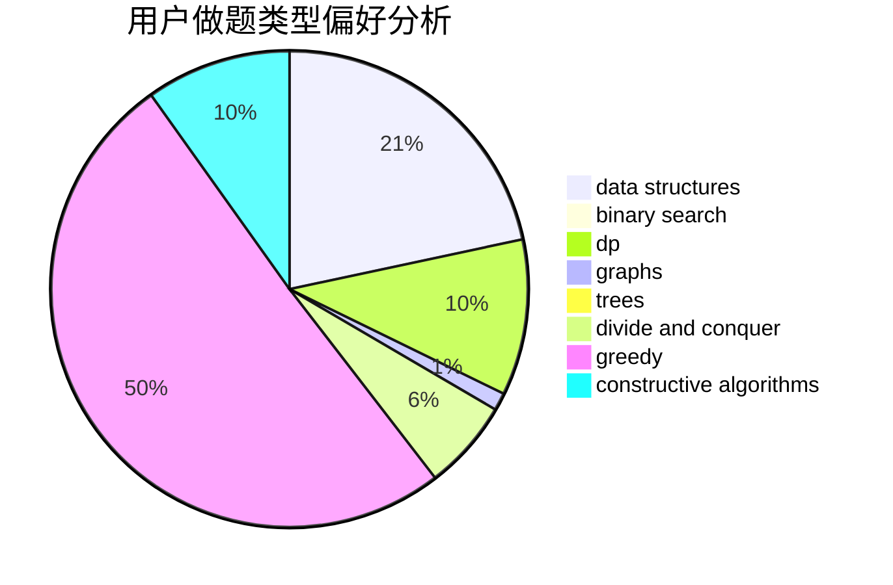
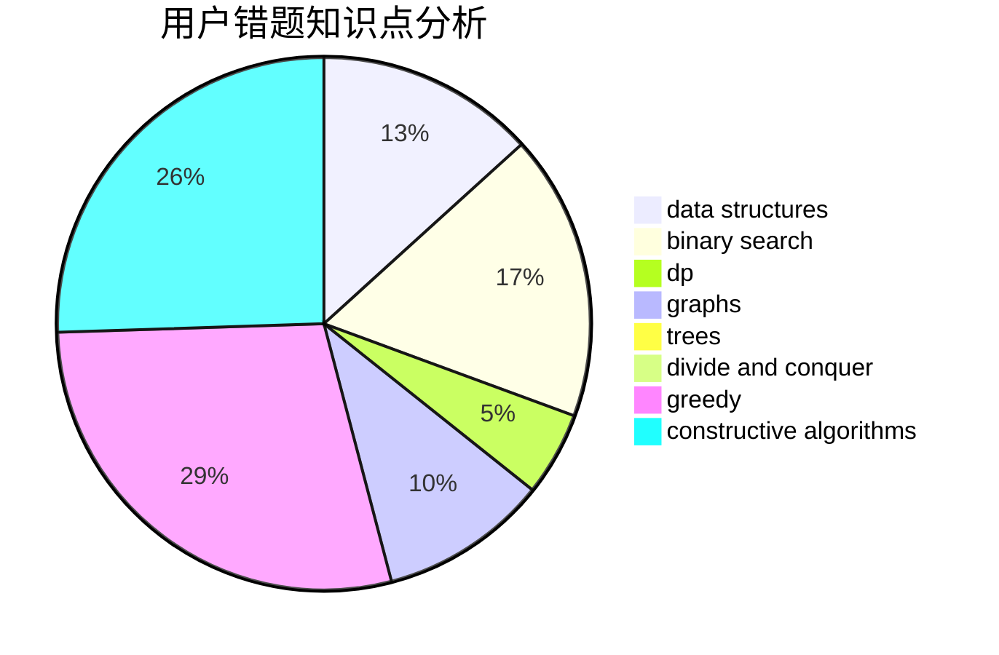

# r0wHa0

<!-- tabs:start -->

#### **用户提交结果分析**

#### **用户做题类型偏好分析**

#### **用户错题知识点分析**

<!-- tabs:end -->
# 推荐题目
[1157E](https://codeforces.com/contest/1157/problem/E)		binary search,
                        data structures,
                        greedy		  
[982D](https://codeforces.com/contest/982/problem/D)		brute force,
                        data structures,
                        dsu,
                        trees		  
[1432A](https://codeforces.com/contest/1432/problem/A)		dsu,graphs,sortings,trees		  
[797C](https://codeforces.com/contest/797/problem/C)		data structures,
                        greedy,
                        strings		  
[764C](https://codeforces.com/contest/764/problem/C)		dsu,graphs,sortings,trees		  
[441C](https://codeforces.com/contest/441/problem/C)		constructive algorithms,
                        dfs and similar,
                        implementation		  
[1086B](https://codeforces.com/contest/1086/problem/B)		dsu,graphs,sortings,trees		  
[299C](https://codeforces.com/contest/299/problem/C)		dsu,graphs,sortings,trees		  
[11951](https://codeforces.com/contest/1195/problem/1)		dsu,graphs,sortings,trees		  
[604C](https://codeforces.com/contest/604/problem/C)		dsu,graphs,sortings,trees		  
