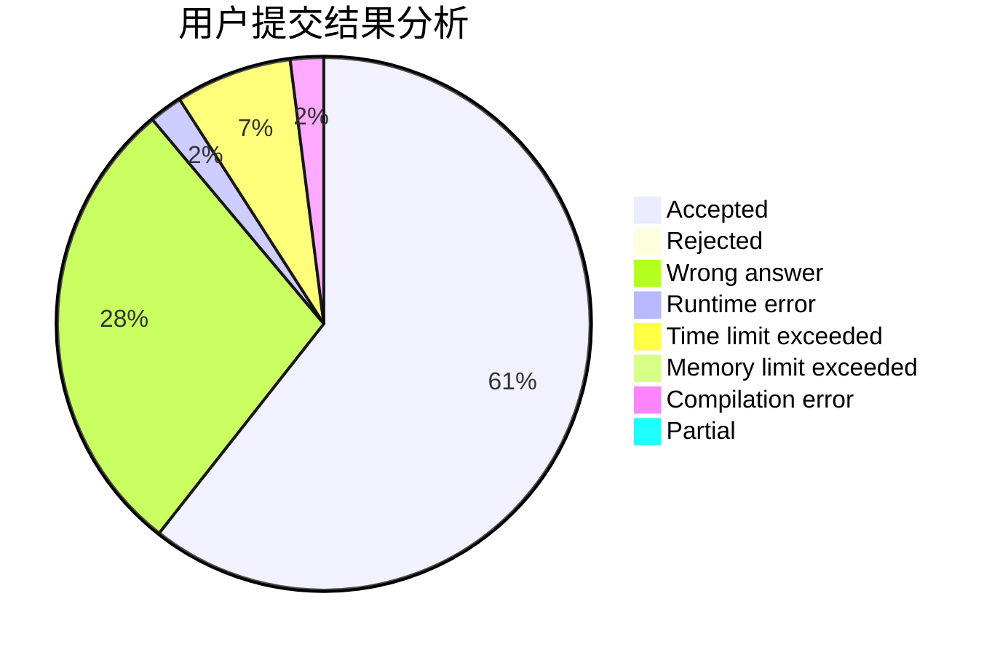
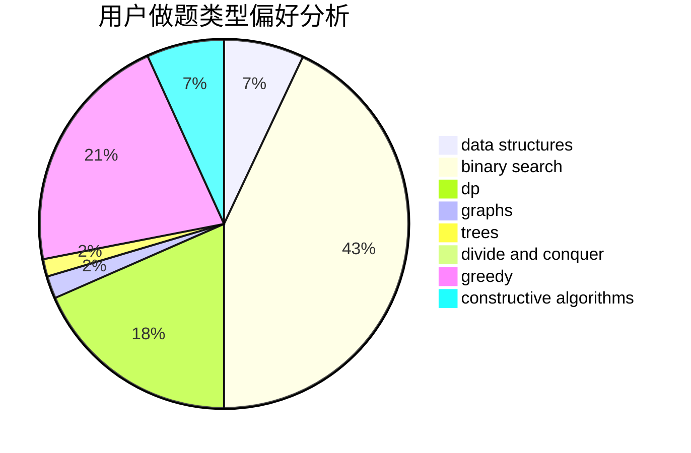
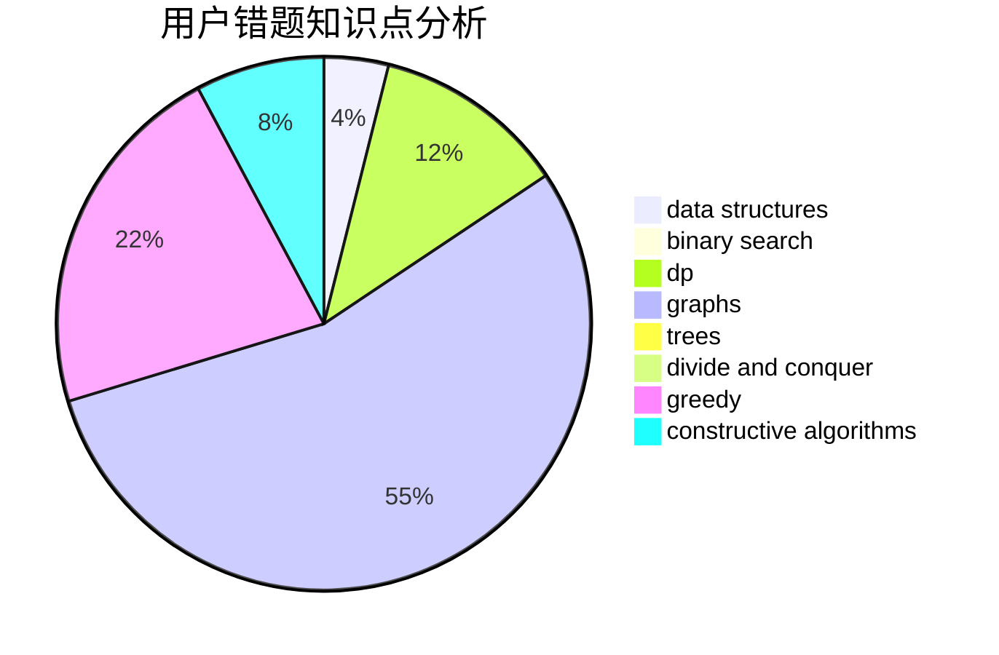

# rainty7

<!-- tabs:start -->

#### **用户提交结果分析**

#### **用户做题类型偏好分析**

#### **用户错题知识点分析**

<!-- tabs:end -->
# 推荐题目
[67A](https://codeforces.com/contest/67/problem/A)		dp,
                        graphs,
                        greedy,
                        implementation		  
[963C](https://codeforces.com/contest/963/problem/C)		brute force,
                        math,
                        number theory		  
[848C](https://codeforces.com/contest/848/problem/C)		data structures,
                        divide and conquer		  
[1053B](https://codeforces.com/contest/1053/problem/B)		dsu,graphs,sortings,trees		  
[919B](https://codeforces.com/contest/919/problem/B)		binary search,
                        brute force,
                        dp,
                        implementation,
                        number theory		  
[1405B](https://codeforces.com/contest/1405/problem/B)		constructive algorithms,
                        implementation		  
[933A](https://codeforces.com/contest/933/problem/A)		dp		  
[494E](https://codeforces.com/contest/494/problem/E)		data structures,
                        games		  
[978G](https://codeforces.com/contest/978/problem/G)		greedy,
                        implementation,
                        sortings		  
[666D](https://codeforces.com/contest/666/problem/D)		brute force,
                        geometry		  
