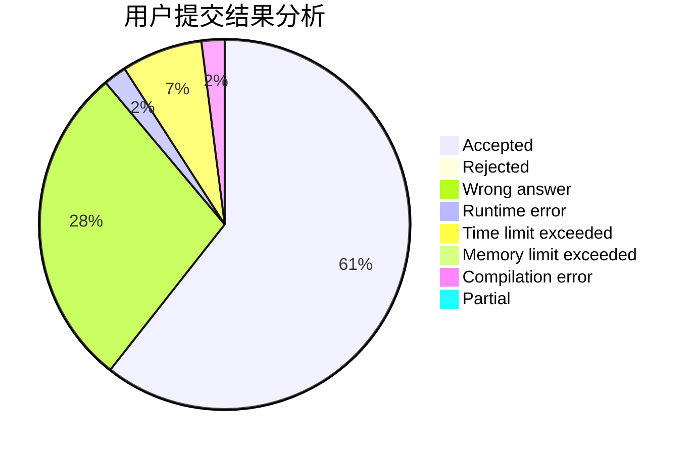
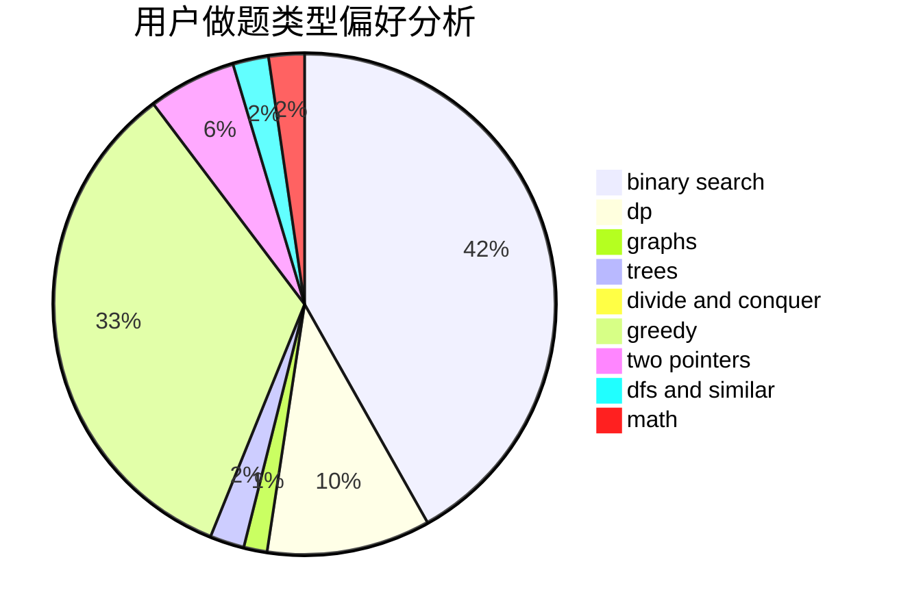

# rainty7

<!-- tabs:start -->

#### **用户提交结果分析**

#### **用户做题类型偏好分析**

<!-- tabs:end -->
# 推荐题目
[67A](https://codeforces.com/contest/67/problem/A)
[963C](https://codeforces.com/contest/963/problem/C)
[848C](https://codeforces.com/contest/848/problem/C)
[1053B](https://codeforces.com/contest/1053/problem/B)
[919B](https://codeforces.com/contest/919/problem/B)
[1405B](https://codeforces.com/contest/1405/problem/B)
[933A](https://codeforces.com/contest/933/problem/A)
[494E](https://codeforces.com/contest/494/problem/E)
[978G](https://codeforces.com/contest/978/problem/G)
[666D](https://codeforces.com/contest/666/problem/D)
