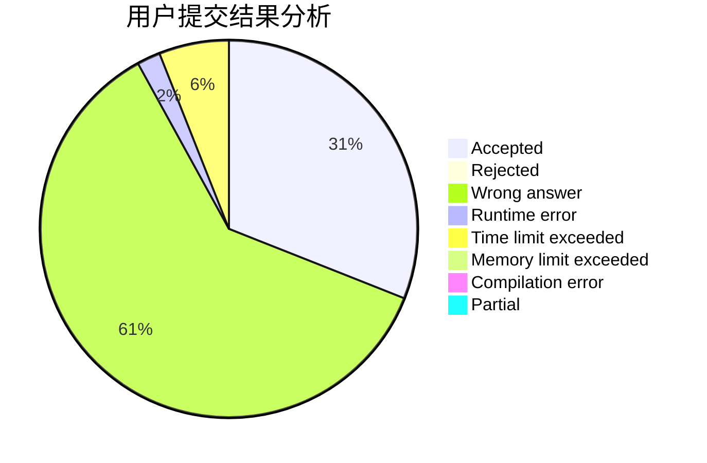
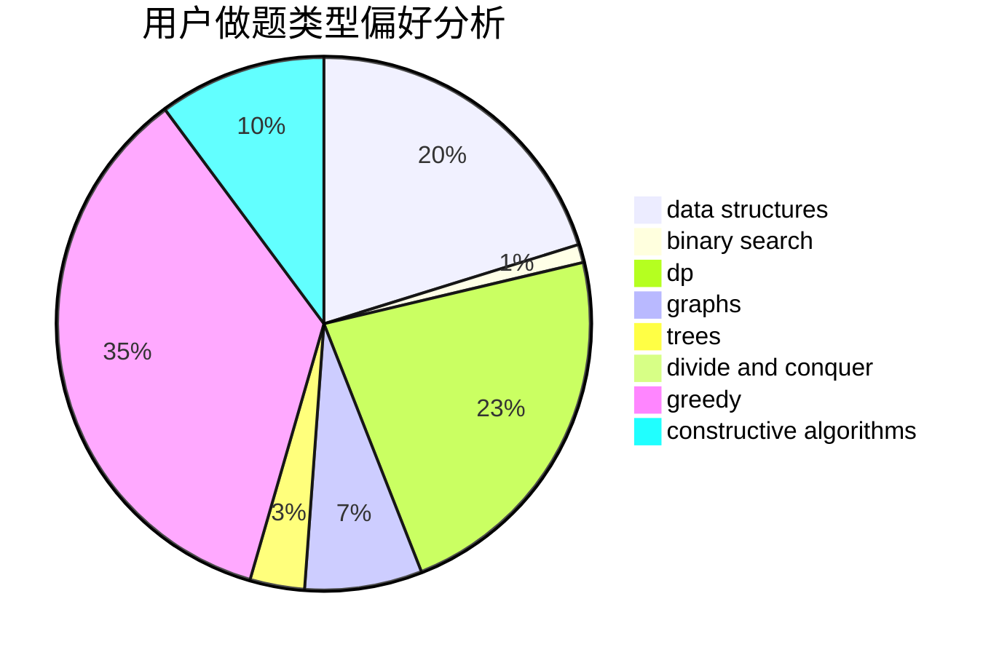
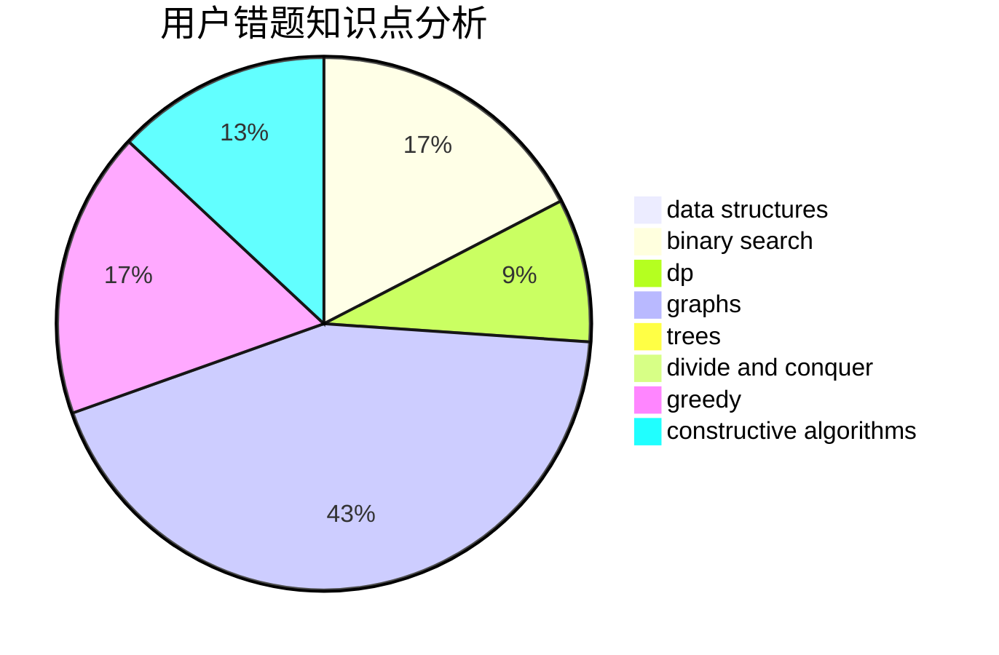

# random_shuffle

<!-- tabs:start -->

#### **用户提交结果分析**

#### **用户做题类型偏好分析**

#### **用户错题知识点分析**

<!-- tabs:end -->
# 推荐题目
[701C](https://codeforces.com/contest/701/problem/C)		binary search,
                        strings,
                        two pointers		  
[716B](https://codeforces.com/contest/716/problem/B)		greedy,
                        two pointers		  
[776B](https://codeforces.com/contest/776/problem/B)		constructive algorithms,
                        number theory		  
[11521](https://codeforces.com/contest/1152/problem/1)		dsu,graphs,sortings,trees		  
[1099E](https://codeforces.com/contest/1099/problem/E)		dsu,graphs,sortings,trees		  
[44A](https://codeforces.com/contest/44/problem/A)		implementation		  
[1172A](https://codeforces.com/contest/1172/problem/A)		greedy,
                        implementation		  
[1489C](https://codeforces.com/contest/1489/problem/C)		dsu,graphs,sortings,trees		  
[962C](https://codeforces.com/contest/962/problem/C)		brute force,
                        implementation,
                        math		  
[392B](https://codeforces.com/contest/392/problem/B)		dp		  
