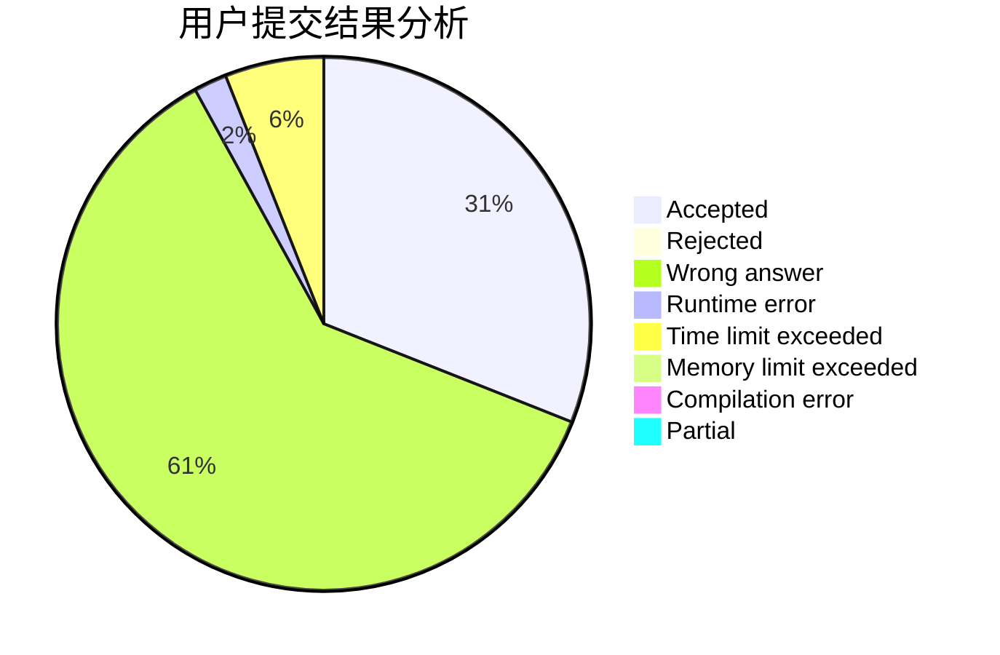
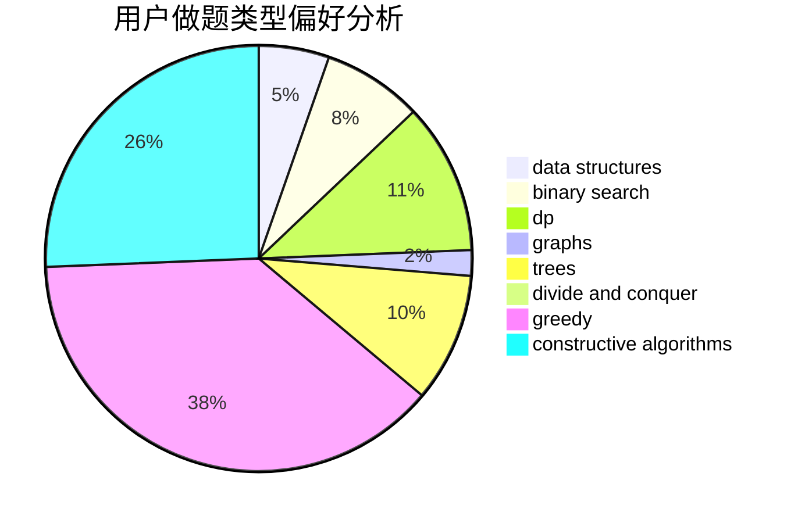
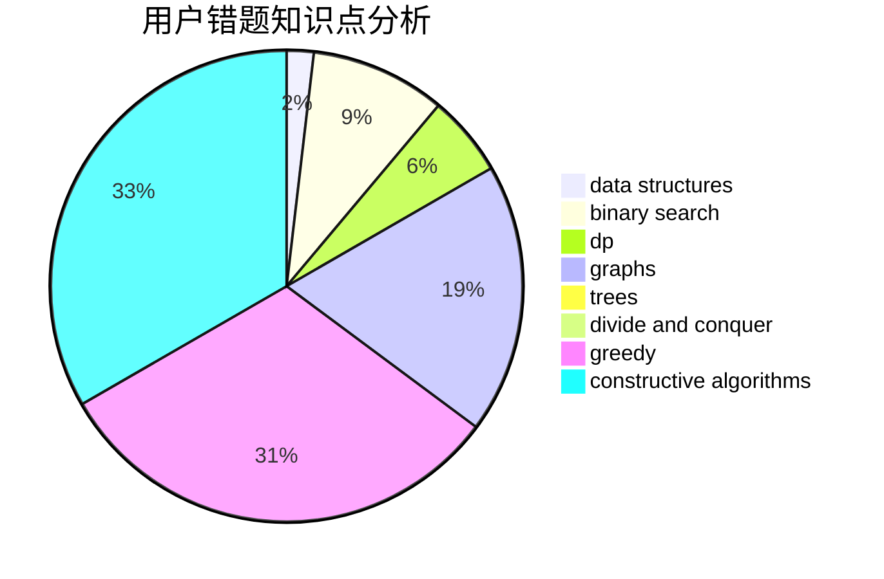

# random_shuffle

<!-- tabs:start -->

#### **用户提交结果分析**

#### **用户做题类型偏好分析**

#### **用户错题知识点分析**

<!-- tabs:end -->
# 推荐题目
[677C](https://codeforces.com/contest/677/problem/C)		bitmasks,
                        combinatorics,
                        implementation,
                        strings		  
[699C](https://codeforces.com/contest/699/problem/C)		dsu,graphs,sortings,trees		  
[756D](https://codeforces.com/contest/756/problem/D)		brute force,
                        combinatorics,
                        dp,
                        string suffix structures		  
[114D](https://codeforces.com/contest/114/problem/D)		dsu,graphs,sortings,trees		  
[1099B](https://codeforces.com/contest/1099/problem/B)		binary search,
                        constructive algorithms,
                        math		  
[427B](https://codeforces.com/contest/427/problem/B)		data structures,
                        implementation		  
[1167D](https://codeforces.com/contest/1167/problem/D)		constructive algorithms,
                        greedy		  
[1481A](https://codeforces.com/contest/1481/problem/A)		greedy,
                        strings		  
[940F](https://codeforces.com/contest/940/problem/F)		brute force,
                        data structures		  
[364E](https://codeforces.com/contest/364/problem/E)		divide and conquer,
                        two pointers		  
