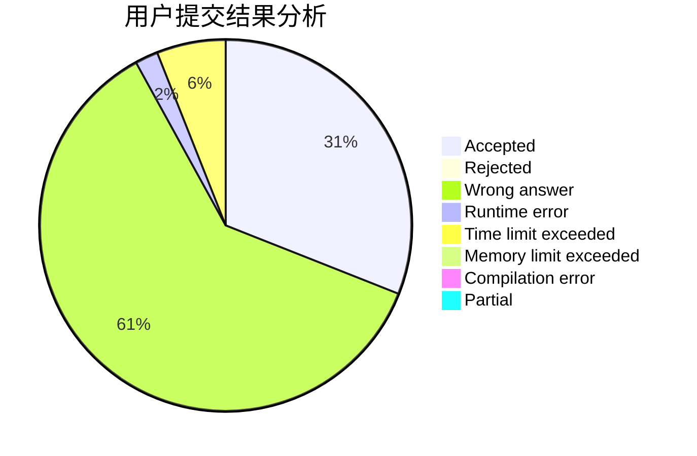
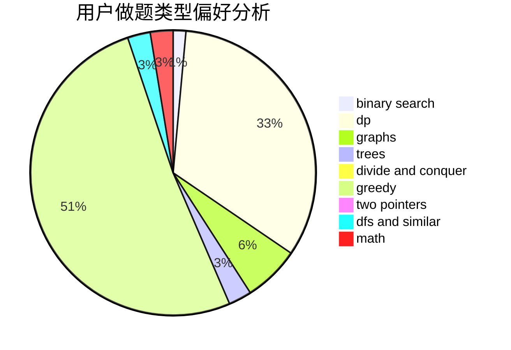

# random_shuffle

<!-- tabs:start -->

#### **用户提交结果分析**

#### **用户做题类型偏好分析**

<!-- tabs:end -->
# 推荐题目
[701C](https://codeforces.com/contest/701/problem/C)
[716B](https://codeforces.com/contest/716/problem/B)
[776B](https://codeforces.com/contest/776/problem/B)
[11521](https://codeforces.com/contest/1152/problem/1)
[1099E](https://codeforces.com/contest/1099/problem/E)
[44A](https://codeforces.com/contest/44/problem/A)
[1172A](https://codeforces.com/contest/1172/problem/A)
[1489C](https://codeforces.com/contest/1489/problem/C)
[962C](https://codeforces.com/contest/962/problem/C)
[392B](https://codeforces.com/contest/392/problem/B)
