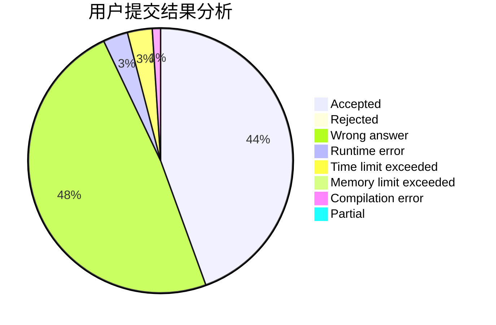
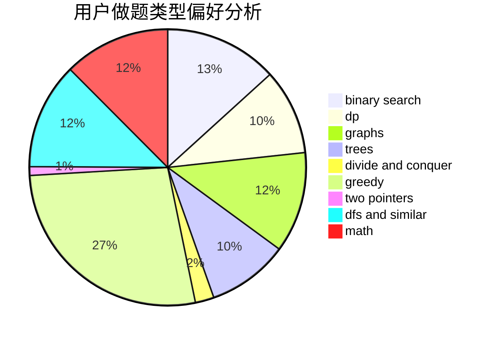

# randow

<!-- tabs:start -->

#### **用户提交结果分析**

#### **用户做题类型偏好分析**

<!-- tabs:end -->
# 推荐题目
[1042B](https://codeforces.com/contest/1042/problem/B)
[367B](https://codeforces.com/contest/367/problem/B)
[899C](https://codeforces.com/contest/899/problem/C)
[61E](https://codeforces.com/contest/61/problem/E)
[212E](https://codeforces.com/contest/212/problem/E)
[1194F](https://codeforces.com/contest/1194/problem/F)
[1392E](https://codeforces.com/contest/1392/problem/E)
[1223B](https://codeforces.com/contest/1223/problem/B)
[216C](https://codeforces.com/contest/216/problem/C)
[592D](https://codeforces.com/contest/592/problem/D)
