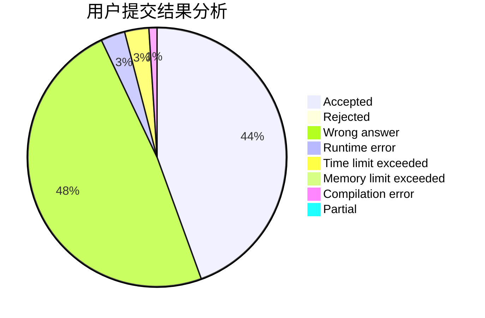
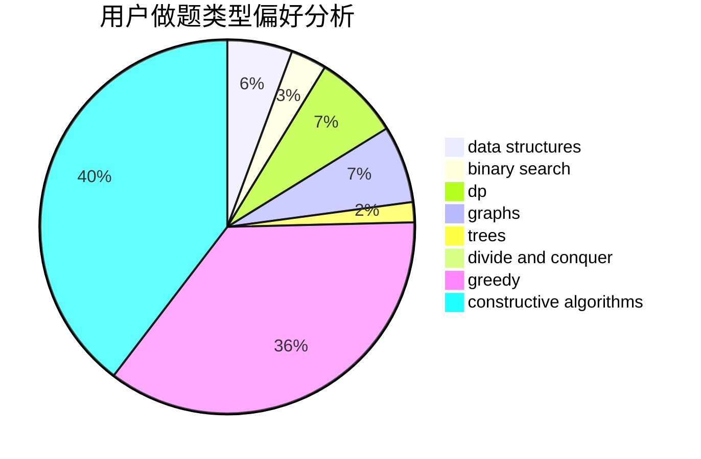
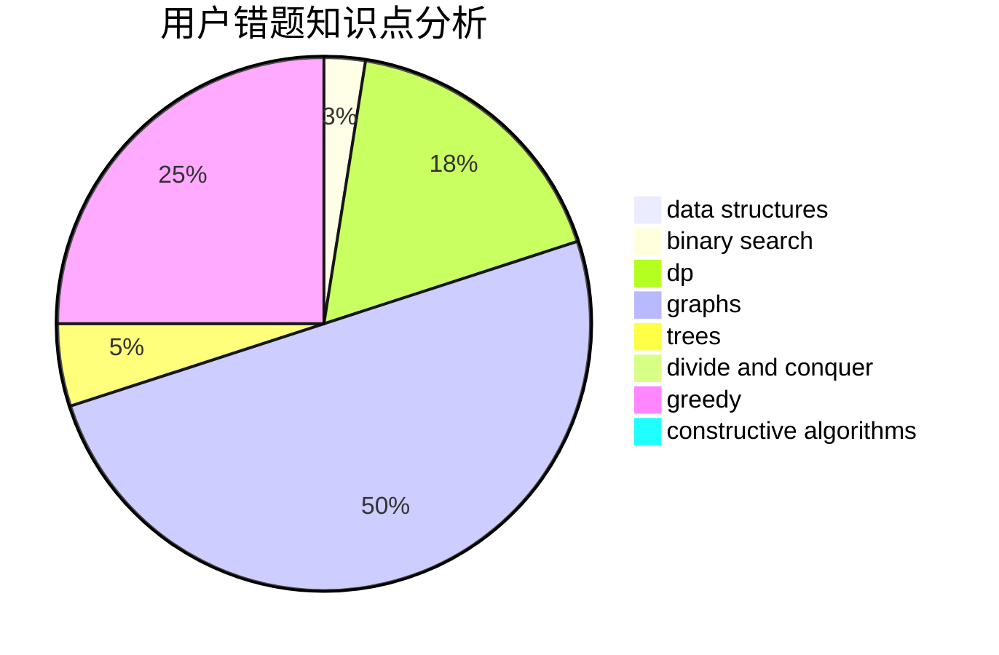

# randow

<!-- tabs:start -->

#### **用户提交结果分析**

#### **用户做题类型偏好分析**

#### **用户错题知识点分析**

<!-- tabs:end -->
# 推荐题目
[1042B](https://codeforces.com/contest/1042/problem/B)		bitmasks,
                        brute force,
                        dp,
                        implementation		  
[367B](https://codeforces.com/contest/367/problem/B)		binary search,
                        data structures		  
[899C](https://codeforces.com/contest/899/problem/C)		constructive algorithms,
                        graphs,
                        math		  
[61E](https://codeforces.com/contest/61/problem/E)		data structures,
                        trees		  
[212E](https://codeforces.com/contest/212/problem/E)		dfs and similar,
                        dp,
                        trees		  
[1194F](https://codeforces.com/contest/1194/problem/F)		combinatorics,
                        dp,
                        number theory,
                        probabilities,
                        two pointers		  
[1392E](https://codeforces.com/contest/1392/problem/E)		bitmasks,
                        constructive algorithms,
                        interactive,
                        math		  
[1223B](https://codeforces.com/contest/1223/problem/B)		strings		  
[216C](https://codeforces.com/contest/216/problem/C)		greedy		  
[592D](https://codeforces.com/contest/592/problem/D)		dfs and similar,
                        dp,
                        graphs,
                        trees		  
