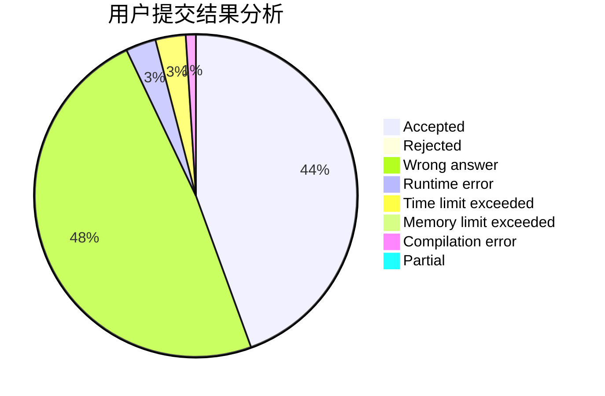
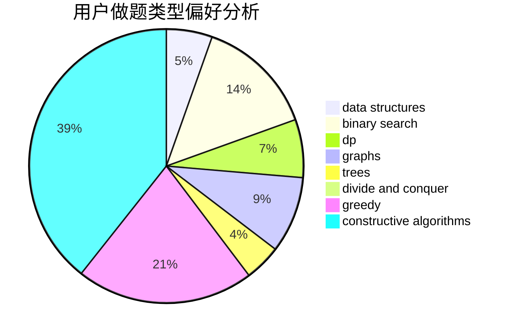
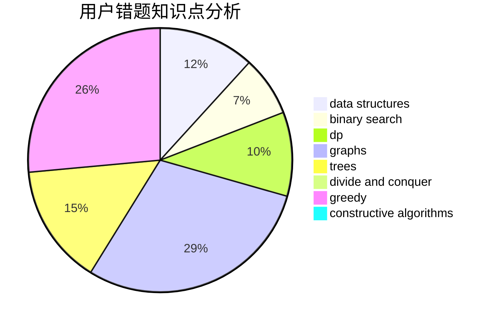

# randow

<!-- tabs:start -->

#### **用户提交结果分析**

#### **用户做题类型偏好分析**

#### **用户错题知识点分析**

<!-- tabs:end -->
# 推荐题目
[1041E](https://codeforces.com/contest/1041/problem/E)		constructive algorithms,
                        data structures,
                        graphs,
                        greedy		  
[33A](https://codeforces.com/contest/33/problem/A)		greedy,
                        implementation		  
[878D](https://codeforces.com/contest/878/problem/D)		bitmasks		  
[600D](https://codeforces.com/contest/600/problem/D)		geometry		  
[189A](https://codeforces.com/contest/189/problem/A)		brute force,
                        dp		  
[1189D1](https://codeforces.com/contest/1189D/problem/1)		dsu,graphs,sortings,trees		  
[1382C1](https://codeforces.com/contest/1382C/problem/1)		dsu,graphs,sortings,trees		  
[1216E2](https://codeforces.com/contest/1216E/problem/2)		binary search,
                        math		  
[193B](https://codeforces.com/contest/193/problem/B)		brute force		  
[573B](https://codeforces.com/contest/573/problem/B)		binary search,
                        data structures,
                        dp,
                        math		  
