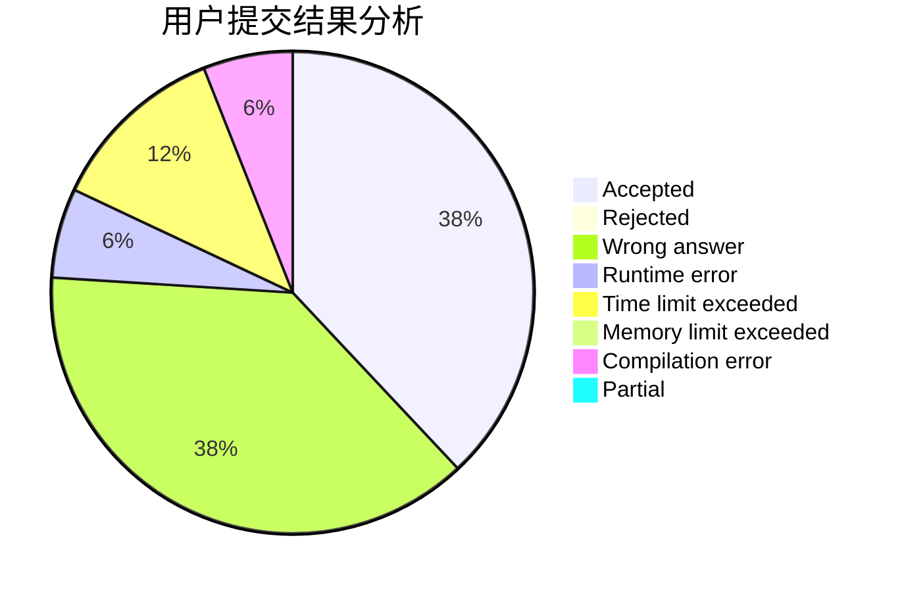
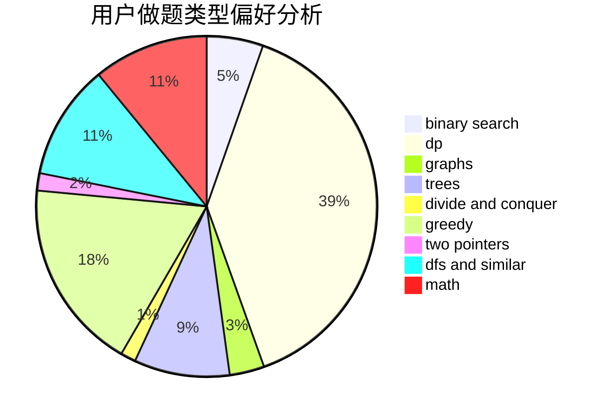

# rankYu

<!-- tabs:start -->

#### **用户提交结果分析**

#### **用户做题类型偏好分析**

<!-- tabs:end -->
# 推荐题目
[13792](https://codeforces.com/contest/1379/problem/2)
[47B](https://codeforces.com/contest/47/problem/B)
[1129D](https://codeforces.com/contest/1129/problem/D)
[516A](https://codeforces.com/contest/516/problem/A)
[515A](https://codeforces.com/contest/515/problem/A)
[622D](https://codeforces.com/contest/622/problem/D)
[1034D](https://codeforces.com/contest/1034/problem/D)
[580D](https://codeforces.com/contest/580/problem/D)
[710E](https://codeforces.com/contest/710/problem/E)
[977C](https://codeforces.com/contest/977/problem/C)
