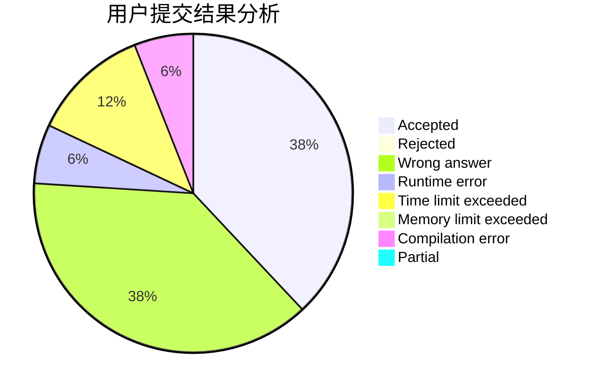
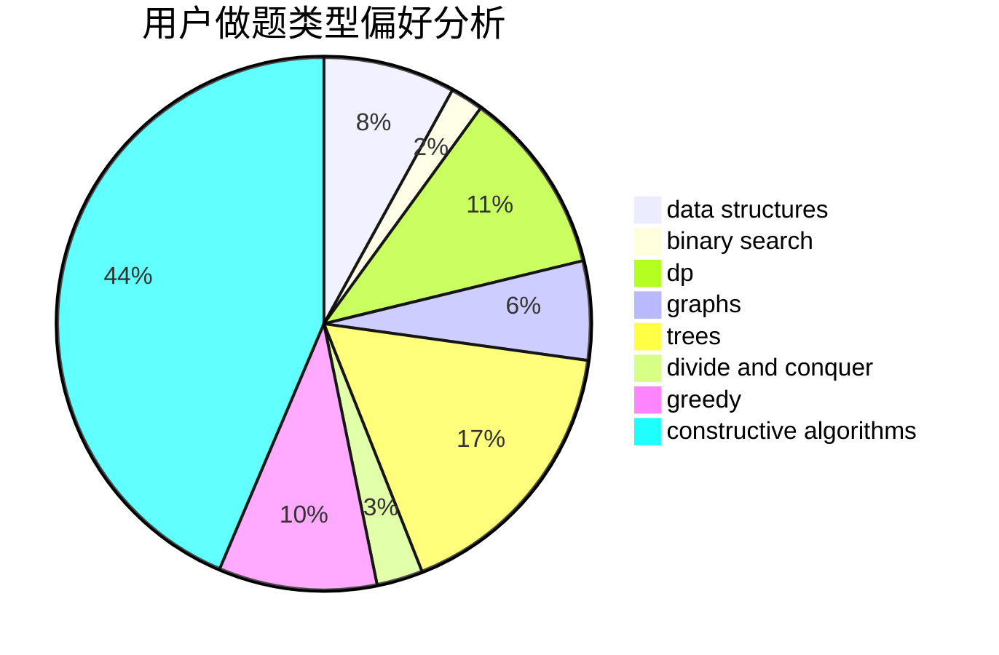
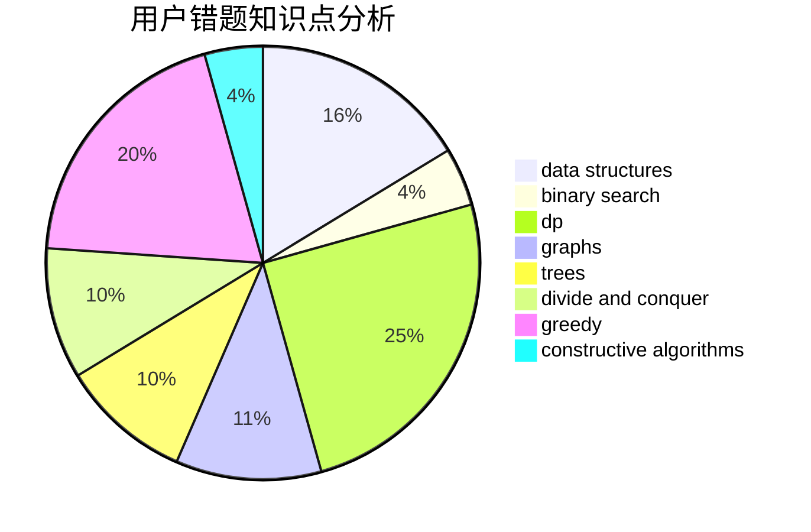

# rankYu

<!-- tabs:start -->

#### **用户提交结果分析**

#### **用户做题类型偏好分析**

#### **用户错题知识点分析**

<!-- tabs:end -->
# 推荐题目
[13792](https://codeforces.com/contest/1379/problem/2)		dsu,graphs,sortings,trees		  
[47B](https://codeforces.com/contest/47/problem/B)		implementation		  
[1129D](https://codeforces.com/contest/1129/problem/D)		data structures,
                        dp		  
[516A](https://codeforces.com/contest/516/problem/A)		dsu,graphs,sortings,trees		  
[515A](https://codeforces.com/contest/515/problem/A)		math		  
[622D](https://codeforces.com/contest/622/problem/D)		constructive algorithms		  
[1034D](https://codeforces.com/contest/1034/problem/D)		binary search,
                        data structures,
                        two pointers		  
[580D](https://codeforces.com/contest/580/problem/D)		bitmasks,
                        dp		  
[710E](https://codeforces.com/contest/710/problem/E)		dfs and similar,
                        dp		  
[977C](https://codeforces.com/contest/977/problem/C)		sortings		  
