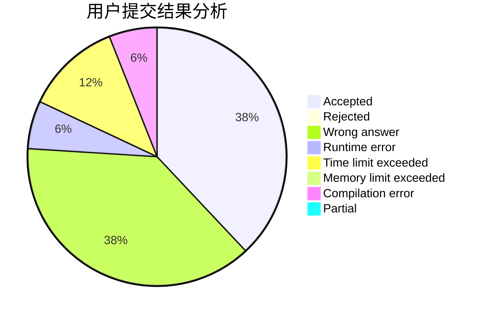
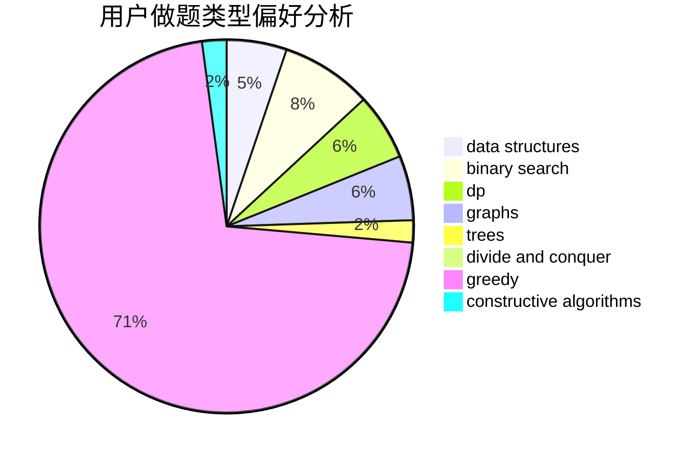
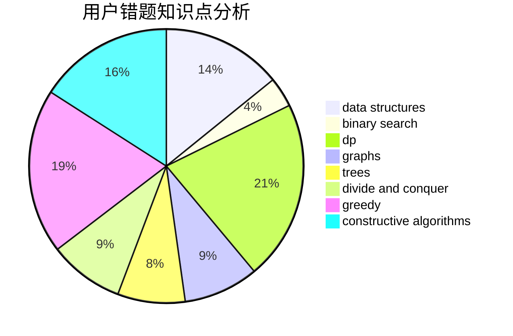

# rankYu

<!-- tabs:start -->

#### **用户提交结果分析**

#### **用户做题类型偏好分析**

#### **用户错题知识点分析**

<!-- tabs:end -->
# 推荐题目
[1370C](https://codeforces.com/contest/1370/problem/C)		games,
                        math,
                        number theory		  
[460D](https://codeforces.com/contest/460/problem/D)		brute force,
                        constructive algorithms,
                        math		  
[1119H](https://codeforces.com/contest/1119/problem/H)		fft,
                        math		  
[496E](https://codeforces.com/contest/496/problem/E)		greedy,
                        sortings		  
[494E](https://codeforces.com/contest/494/problem/E)		data structures,
                        games		  
[604B](https://codeforces.com/contest/604/problem/B)		binary search,
                        greedy		  
[1034A](https://codeforces.com/contest/1034/problem/A)		number theory		  
[557C](https://codeforces.com/contest/557/problem/C)		brute force,
                        data structures,
                        dp,
                        greedy,
                        math,
                        sortings		  
[691A](https://codeforces.com/contest/691/problem/A)		implementation		  
[955C](https://codeforces.com/contest/955/problem/C)		binary search,
                        math,
                        number theory		  
