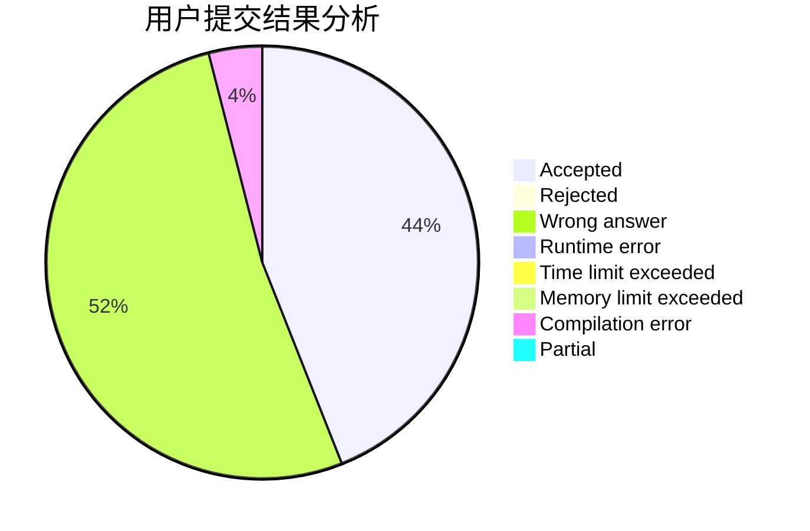
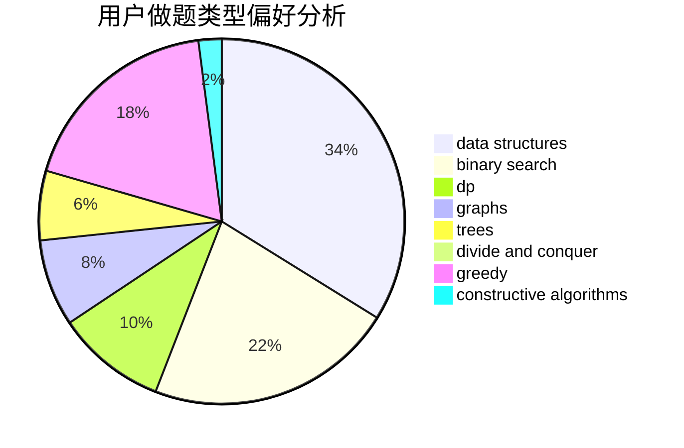
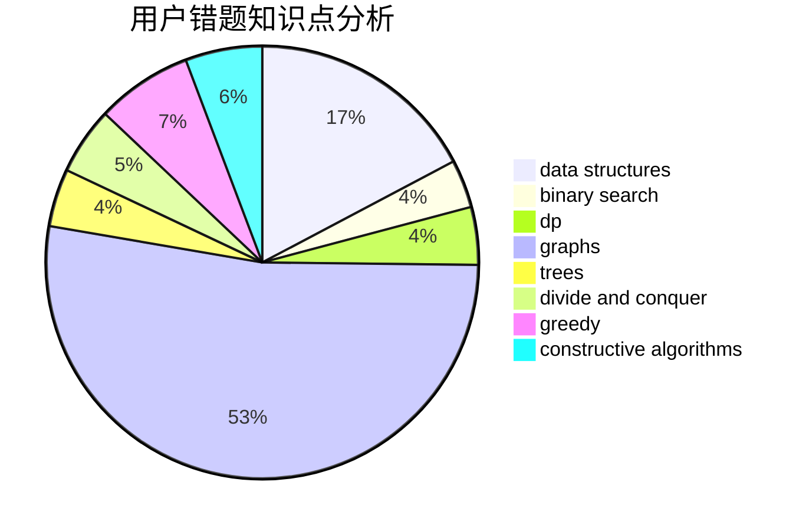

# rcxkk

<!-- tabs:start -->

#### **用户提交结果分析**

#### **用户做题类型偏好分析**

#### **用户错题知识点分析**

<!-- tabs:end -->
# 推荐题目
[854B](https://codeforces.com/contest/854/problem/B)		constructive algorithms,
                        math		  
[750F](https://codeforces.com/contest/750/problem/F)		constructive algorithms,
                        implementation,
                        interactive,
                        trees		  
[732E](https://codeforces.com/contest/732/problem/E)		greedy,
                        sortings		  
[1346E](https://codeforces.com/contest/1346/problem/E)		*special problem,
                        dp,
                        graphs		  
[901A](https://codeforces.com/contest/901/problem/A)		constructive algorithms,
                        trees		  
[1151F](https://codeforces.com/contest/1151/problem/F)		combinatorics,
                        dp,
                        matrices,
                        probabilities		  
[981H](https://codeforces.com/contest/981/problem/H)		combinatorics,
                        data structures,
                        dp,
                        fft,
                        math		  
[312B](https://codeforces.com/contest/312/problem/B)		math,
                        probabilities		  
[918D](https://codeforces.com/contest/918/problem/D)		dsu,graphs,sortings,trees		  
[1175D](https://codeforces.com/contest/1175/problem/D)		greedy,
                        sortings		  
