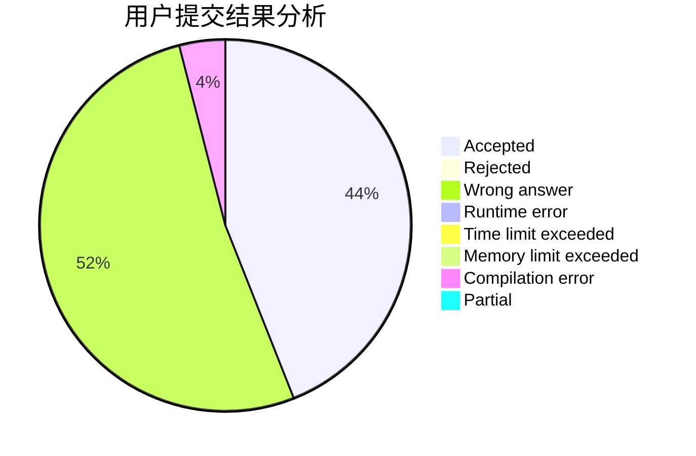
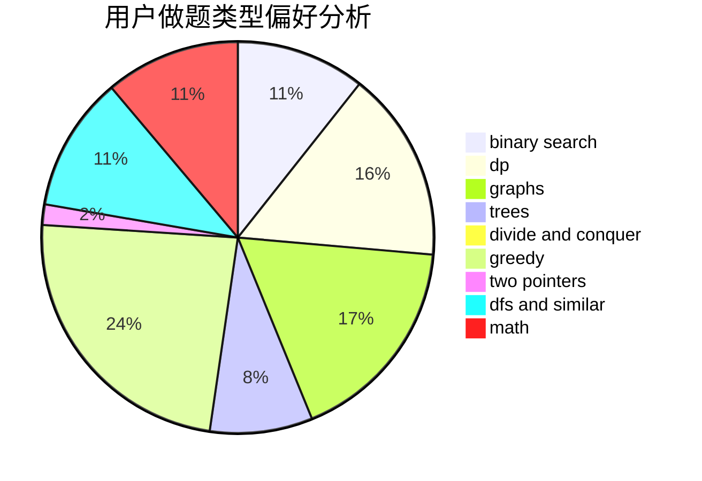

# rcxkk

<!-- tabs:start -->

#### **用户提交结果分析**

#### **用户做题类型偏好分析**

<!-- tabs:end -->
# 推荐题目
[854B](https://codeforces.com/contest/854/problem/B)
[750F](https://codeforces.com/contest/750/problem/F)
[732E](https://codeforces.com/contest/732/problem/E)
[1346E](https://codeforces.com/contest/1346/problem/E)
[901A](https://codeforces.com/contest/901/problem/A)
[1151F](https://codeforces.com/contest/1151/problem/F)
[981H](https://codeforces.com/contest/981/problem/H)
[312B](https://codeforces.com/contest/312/problem/B)
[918D](https://codeforces.com/contest/918/problem/D)
[1175D](https://codeforces.com/contest/1175/problem/D)
