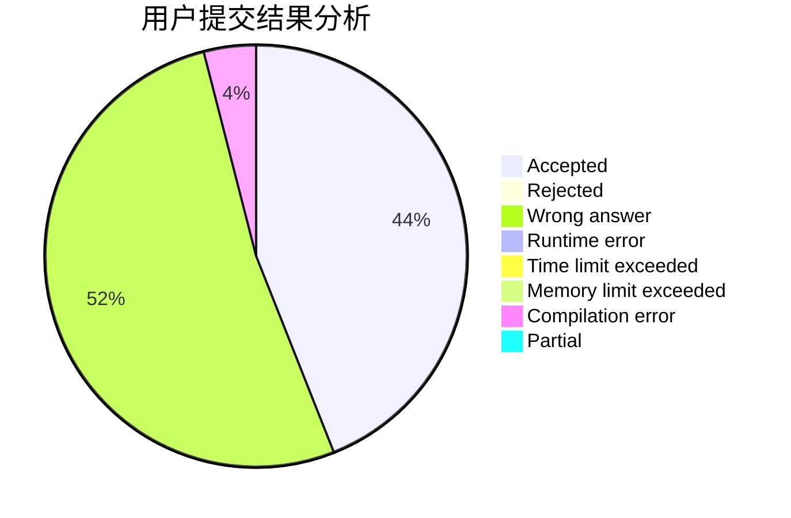
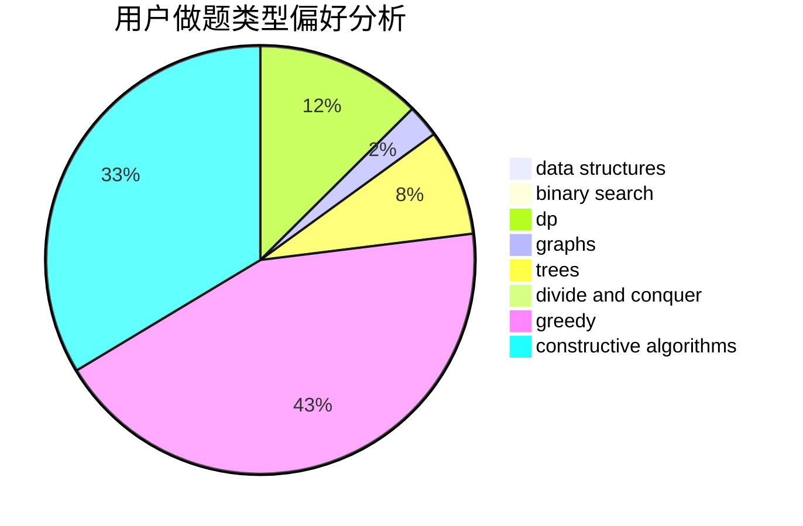
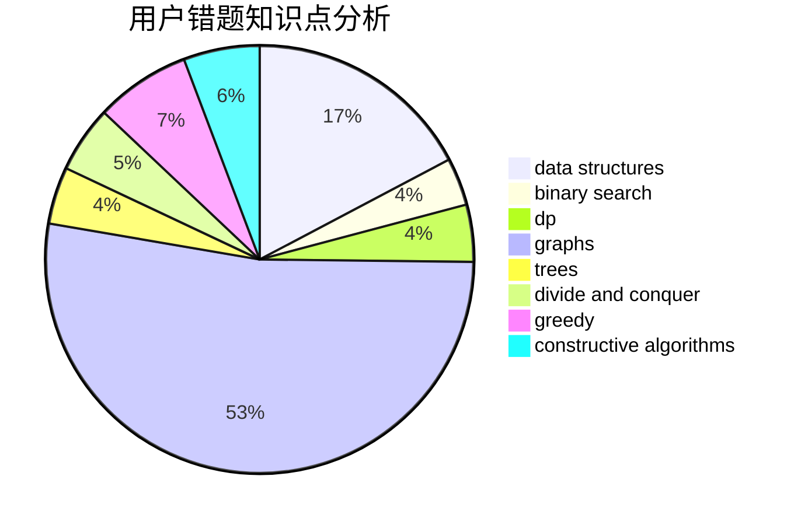

# rcxkk

<!-- tabs:start -->

#### **用户提交结果分析**

#### **用户做题类型偏好分析**

#### **用户错题知识点分析**

<!-- tabs:end -->
# 推荐题目
[837B](https://codeforces.com/contest/837/problem/B)		brute force,
                        implementation		  
[733A](https://codeforces.com/contest/733/problem/A)		implementation		  
[713E](https://codeforces.com/contest/713/problem/E)		binary search,
                        dp		  
[1339E](https://codeforces.com/contest/1339/problem/E)		dsu,graphs,sortings,trees		  
[883G](https://codeforces.com/contest/883/problem/G)		dfs and similar,
                        graphs		  
[114C](https://codeforces.com/contest/114/problem/C)		dsu,graphs,sortings,trees		  
[960A](https://codeforces.com/contest/960/problem/A)		implementation		  
[295D](https://codeforces.com/contest/295/problem/D)		combinatorics,
                        dp		  
[902B](https://codeforces.com/contest/902/problem/B)		dfs and similar,
                        dsu,
                        greedy		  
[1173A](https://codeforces.com/contest/1173/problem/A)		greedy		  
