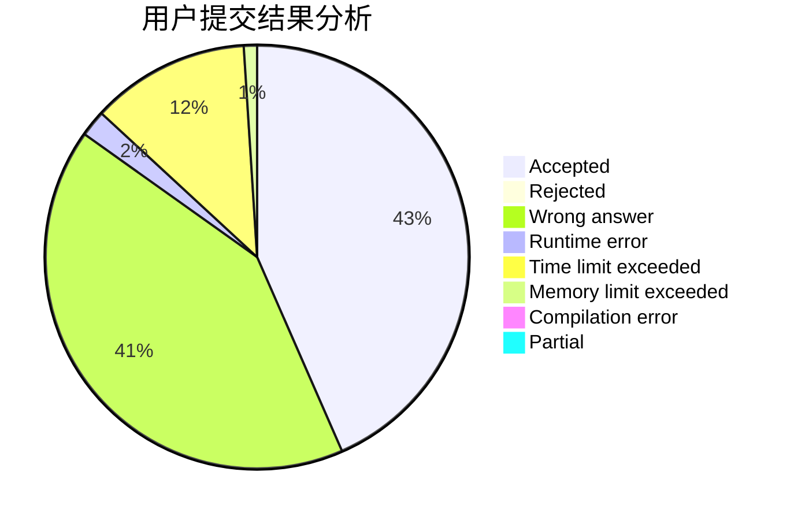
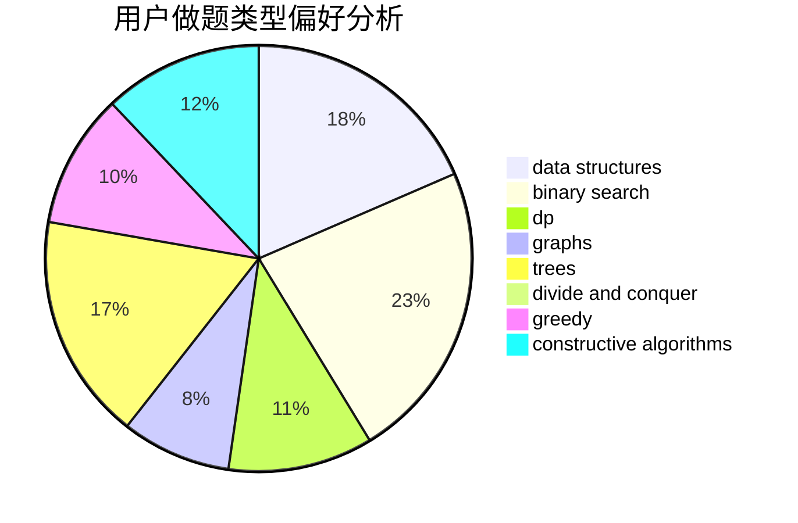
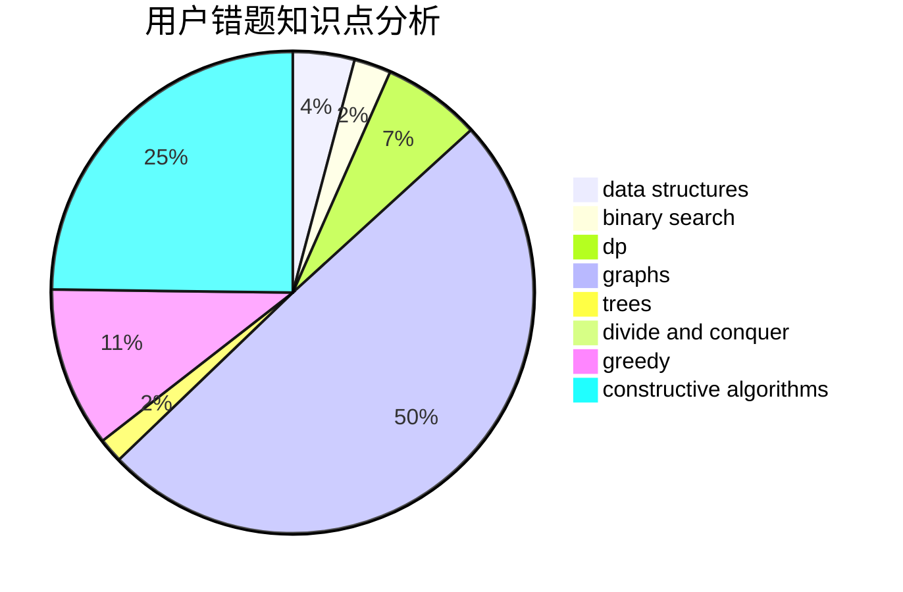

# rdfzXR

<!-- tabs:start -->

#### **用户提交结果分析**

#### **用户做题类型偏好分析**

#### **用户错题知识点分析**

<!-- tabs:end -->
# 推荐题目
[1152F2](https://codeforces.com/contest/1152F/problem/2)		bitmasks,
                        dp,
                        matrices		  
[609A](https://codeforces.com/contest/609/problem/A)		greedy,
                        implementation,
                        sortings		  
[683A](https://codeforces.com/contest/683/problem/A)		*special problem,
                        geometry		  
[508A](https://codeforces.com/contest/508/problem/A)		brute force		  
[18E](https://codeforces.com/contest/18/problem/E)		dp		  
[1118B](https://codeforces.com/contest/1118/problem/B)		implementation		  
[986D](https://codeforces.com/contest/986/problem/D)		fft,
                        math		  
[816C](https://codeforces.com/contest/816/problem/C)		dsu,graphs,sortings,trees		  
[427B](https://codeforces.com/contest/427/problem/B)		data structures,
                        implementation		  
[1030D](https://codeforces.com/contest/1030/problem/D)		geometry,
                        number theory		  
