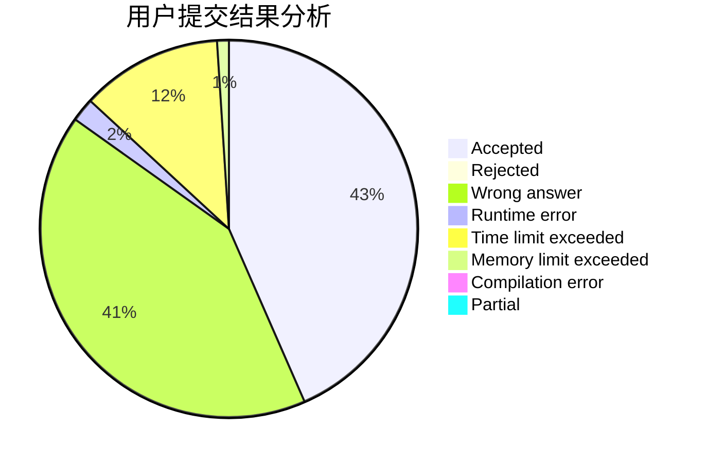
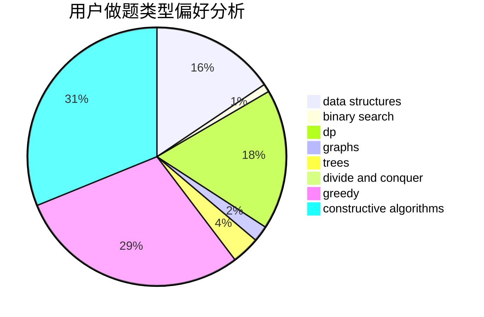
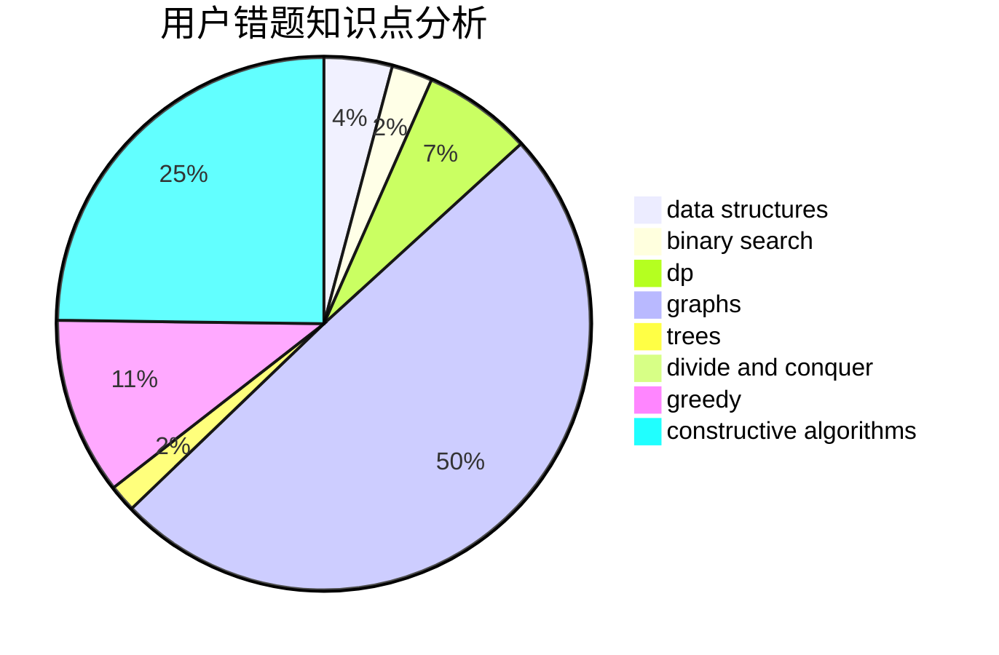

# rdfzXR

<!-- tabs:start -->

#### **用户提交结果分析**

#### **用户做题类型偏好分析**

#### **用户错题知识点分析**

<!-- tabs:end -->
# 推荐题目
[1154G](https://codeforces.com/contest/1154/problem/G)		brute force,
                        greedy,
                        math,
                        number theory		  
[627F](https://codeforces.com/contest/627/problem/F)		dfs and similar,
                        dsu,
                        graphs,
                        trees		  
[707B](https://codeforces.com/contest/707/problem/B)		graphs		  
[528A](https://codeforces.com/contest/528/problem/A)		dsu,graphs,sortings,trees		  
[215C](https://codeforces.com/contest/215/problem/C)		brute force,
                        implementation		  
[1119G](https://codeforces.com/contest/1119/problem/G)		constructive algorithms,
                        implementation		  
[acmsguru6](https://codeforces.com/contest/acmsguru/problem/6)		dsu,graphs,sortings,trees		  
[835D](https://codeforces.com/contest/835/problem/D)		brute force,
                        dp,
                        hashing,
                        strings		  
[44A](https://codeforces.com/contest/44/problem/A)		implementation		  
[1031A](https://codeforces.com/contest/1031/problem/A)		implementation,
                        math		  
