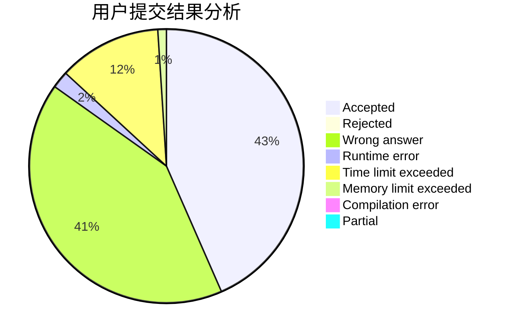
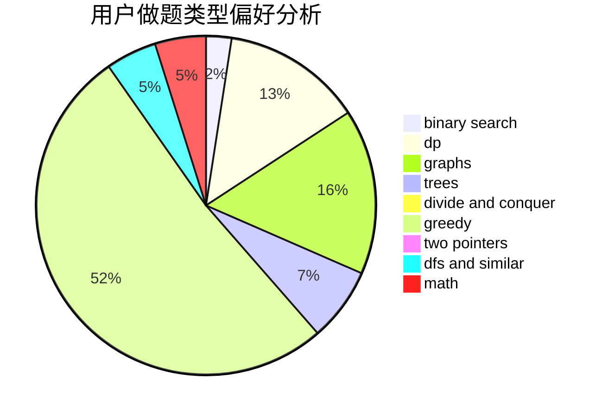

# rdfzXR

<!-- tabs:start -->

#### **用户提交结果分析**

#### **用户做题类型偏好分析**

<!-- tabs:end -->
# 推荐题目
[1154G](https://codeforces.com/contest/1154/problem/G)
[627F](https://codeforces.com/contest/627/problem/F)
[707B](https://codeforces.com/contest/707/problem/B)
[528A](https://codeforces.com/contest/528/problem/A)
[215C](https://codeforces.com/contest/215/problem/C)
[1119G](https://codeforces.com/contest/1119/problem/G)
[acmsguru6](https://codeforces.com/contest/acmsguru/problem/6)
[835D](https://codeforces.com/contest/835/problem/D)
[44A](https://codeforces.com/contest/44/problem/A)
[1031A](https://codeforces.com/contest/1031/problem/A)
