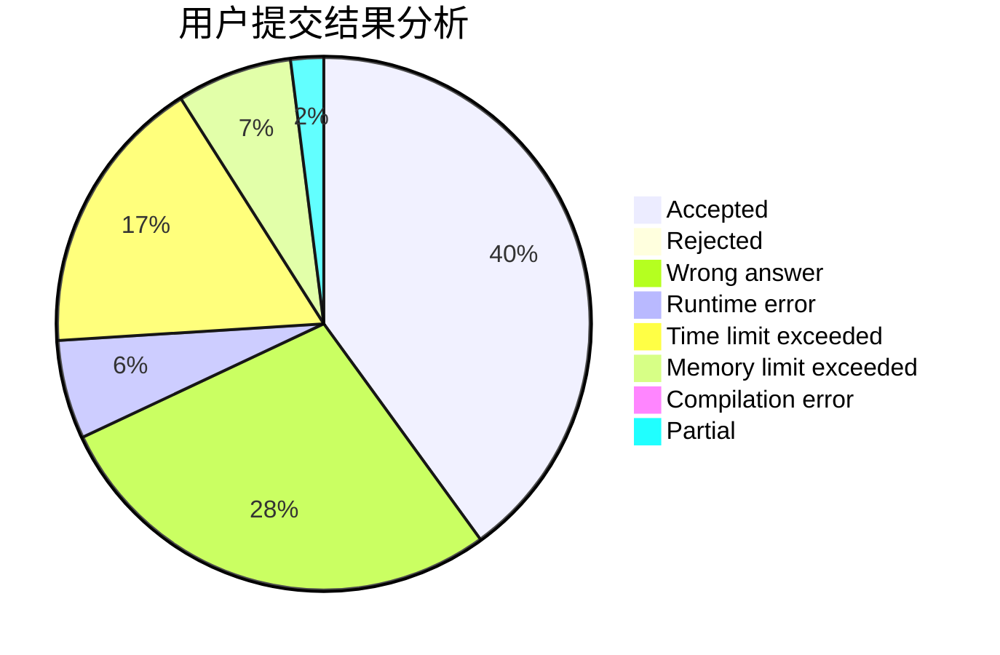
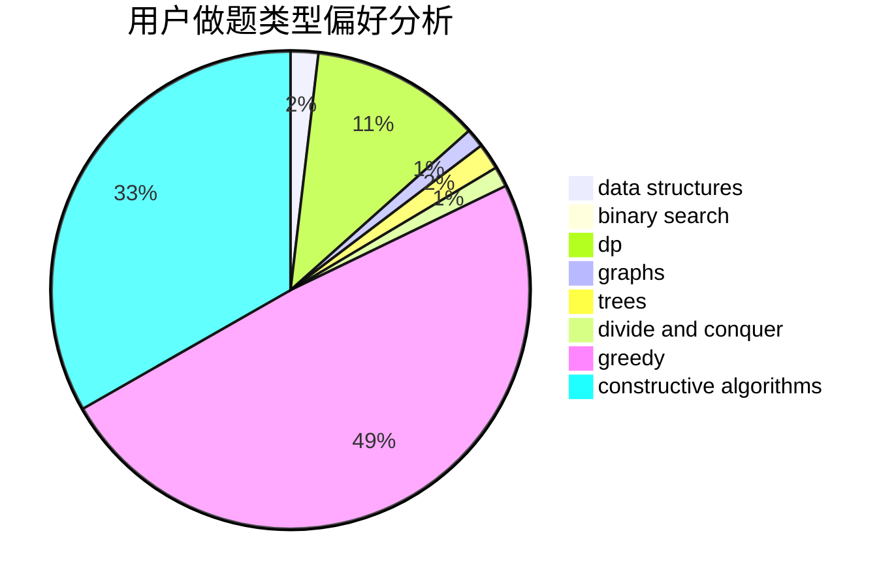
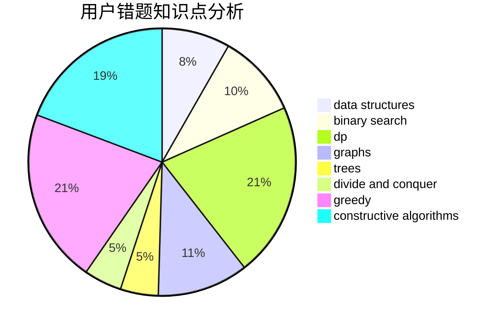

# realFZzzz

<!-- tabs:start -->

#### **用户提交结果分析**

#### **用户做题类型偏好分析**

#### **用户错题知识点分析**

<!-- tabs:end -->
# 推荐题目
[1367D](https://codeforces.com/contest/1367/problem/D)		constructive algorithms,
                        greedy,
                        implementation,
                        sortings		  
[660C](https://codeforces.com/contest/660/problem/C)		binary search,
                        dp,
                        two pointers		  
[1106B](https://codeforces.com/contest/1106/problem/B)		data structures,
                        implementation		  
[959F](https://codeforces.com/contest/959/problem/F)		bitmasks,
                        dp,
                        math,
                        matrices		  
[1496F](https://codeforces.com/contest/1496/problem/F)		dsu,graphs,sortings,trees		  
[450B](https://codeforces.com/contest/450/problem/B)		implementation,
                        math		  
[228B](https://codeforces.com/contest/228/problem/B)		brute force,
                        implementation		  
[18A](https://codeforces.com/contest/18/problem/A)		brute force,
                        geometry		  
[599C](https://codeforces.com/contest/599/problem/C)		sortings		  
[868G](https://codeforces.com/contest/868/problem/G)		math		  
