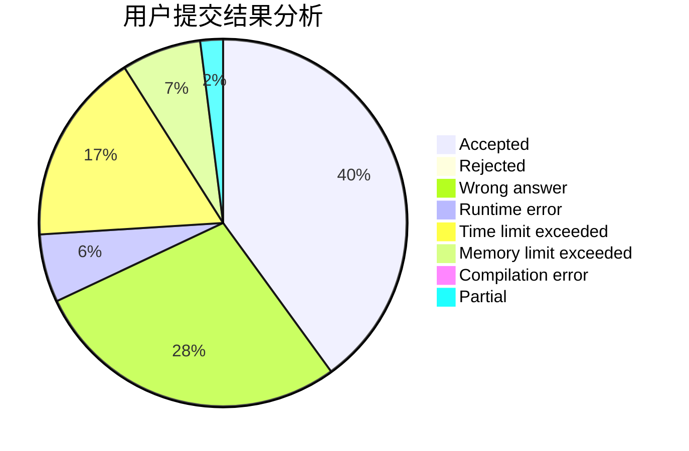
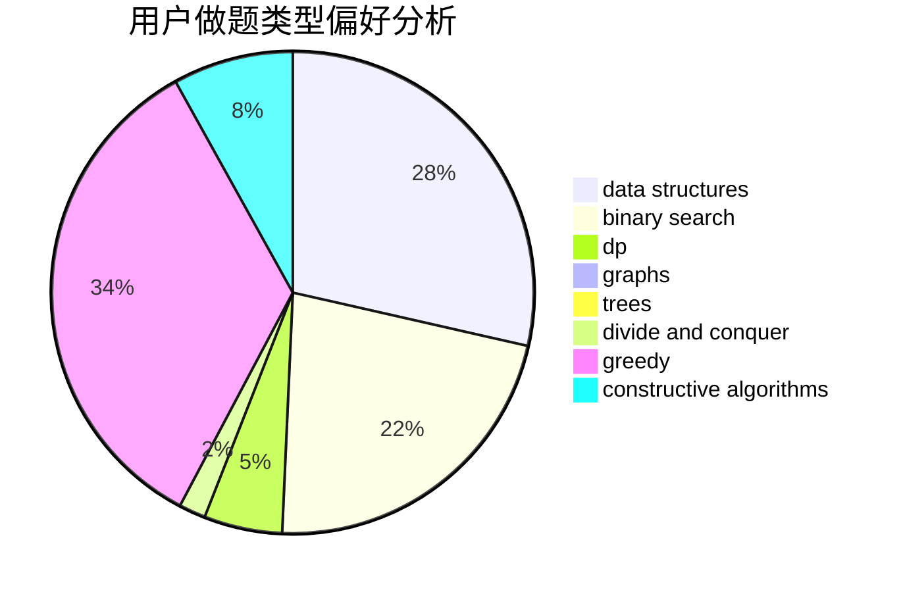
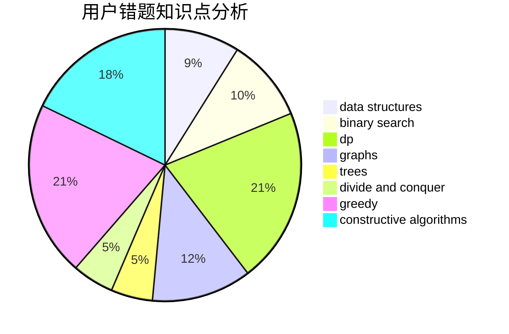

# realFZzzz

<!-- tabs:start -->

#### **用户提交结果分析**

#### **用户做题类型偏好分析**

#### **用户错题知识点分析**

<!-- tabs:end -->
# 推荐题目
[1374A](https://codeforces.com/contest/1374/problem/A)		math		  
[681A](https://codeforces.com/contest/681/problem/A)		implementation		  
[1106E](https://codeforces.com/contest/1106/problem/E)		data structures,
                        dp		  
[981D](https://codeforces.com/contest/981/problem/D)		bitmasks,
                        dp,
                        greedy		  
[1505F](https://codeforces.com/contest/1505/problem/F)		math		  
[472C](https://codeforces.com/contest/472/problem/C)		greedy		  
[246C](https://codeforces.com/contest/246/problem/C)		brute force,
                        constructive algorithms,
                        greedy		  
[215A](https://codeforces.com/contest/215/problem/A)		brute force,
                        implementation		  
[617B](https://codeforces.com/contest/617/problem/B)		combinatorics		  
[888C](https://codeforces.com/contest/888/problem/C)		binary search,
                        implementation,
                        two pointers		  
