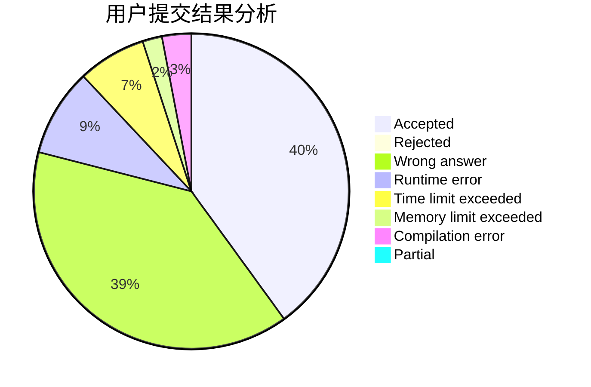
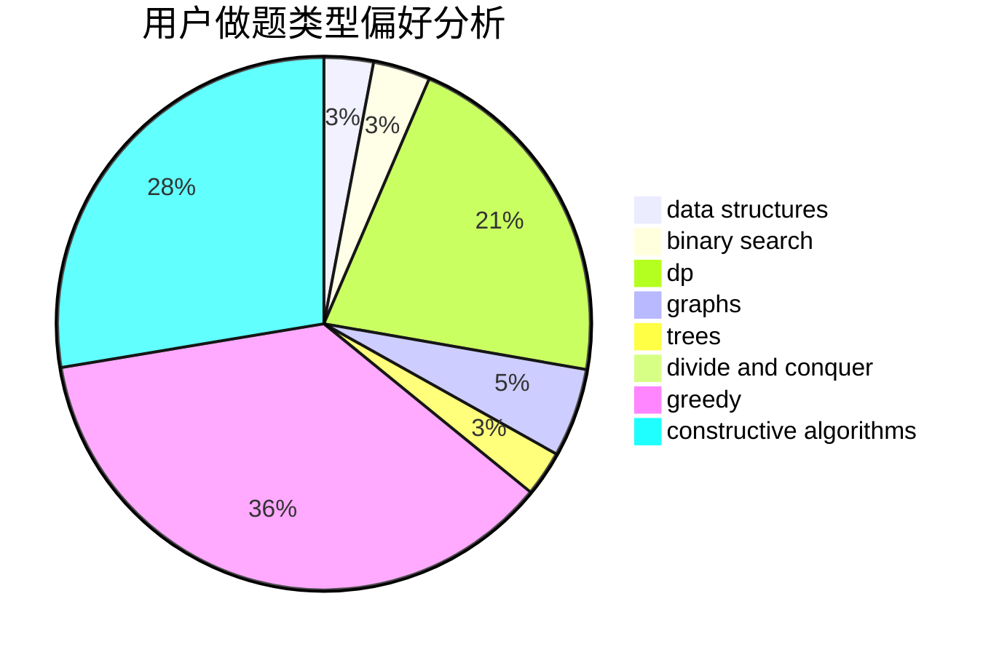
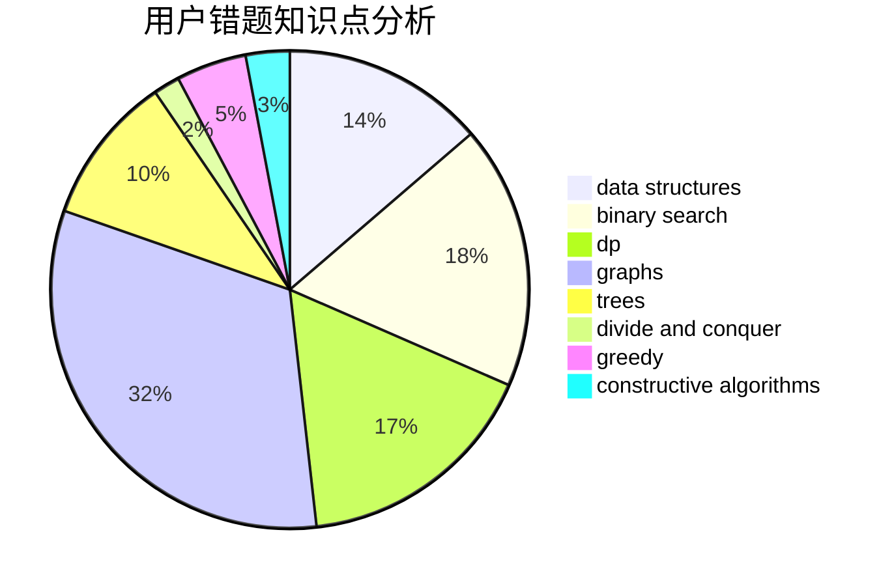

# C20193618

<!-- tabs:start -->

#### **用户提交结果分析**

#### **用户做题类型偏好分析**

#### **用户错题知识点分析**

<!-- tabs:end -->
# 推荐题目
[587A](https://codeforces.com/contest/587/problem/A)		greedy		  
[1325A](https://codeforces.com/contest/1325/problem/A)		constructive algorithms,
                        greedy,
                        number theory		  
[587D](https://codeforces.com/contest/587/problem/D)		2-sat,
                        binary search		  
[1513F](https://codeforces.com/contest/1513/problem/F)		brute force,
                        constructive algorithms,
                        data structures,
                        sortings		  
[585B](https://codeforces.com/contest/585/problem/B)		dfs and similar,
                        graphs,
                        shortest paths		  
[1491F](https://codeforces.com/contest/1491/problem/F)		binary search,
                        constructive algorithms,
                        interactive		  
[1154A](https://codeforces.com/contest/1154/problem/A)		math		  
[587C](https://codeforces.com/contest/587/problem/C)		data structures,
                        trees		  
[1195E](https://codeforces.com/contest/1195/problem/E)		data structures,
                        two pointers		  
[114C](https://codeforces.com/contest/114/problem/C)		dsu,graphs,sortings,trees		  
