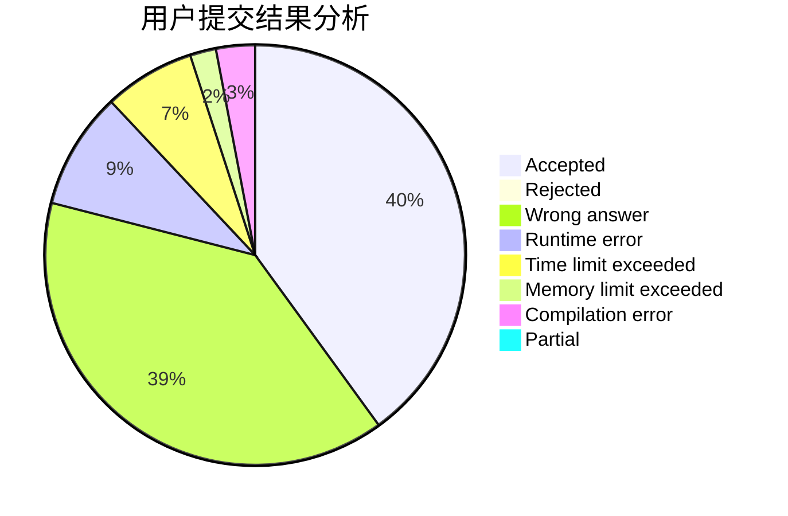
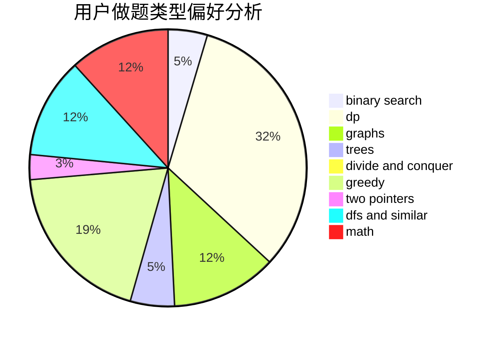

# C20193618

<!-- tabs:start -->

#### **用户提交结果分析**

#### **用户做题类型偏好分析**

<!-- tabs:end -->
# 推荐题目
[607B](https://codeforces.com/contest/607/problem/B)
[1331E](https://codeforces.com/contest/1331/problem/E)
[607E](https://codeforces.com/contest/607/problem/E)
[174B](https://codeforces.com/contest/174/problem/B)
[605C](https://codeforces.com/contest/605/problem/C)
[14C](https://codeforces.com/contest/14/problem/C)
[1156A](https://codeforces.com/contest/1156/problem/A)
[607D](https://codeforces.com/contest/607/problem/D)
[119D](https://codeforces.com/contest/119/problem/D)
[1151F](https://codeforces.com/contest/1151/problem/F)
