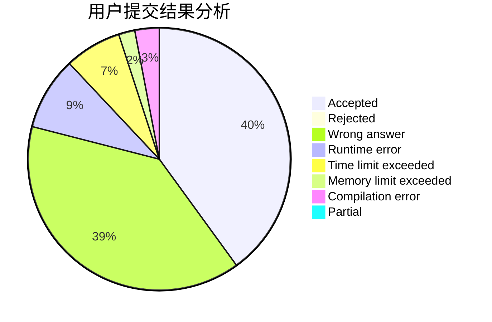
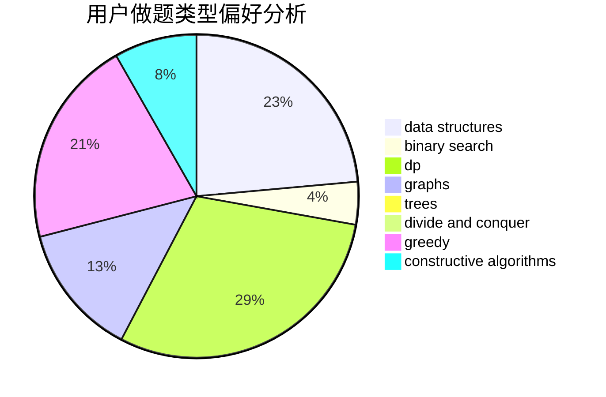
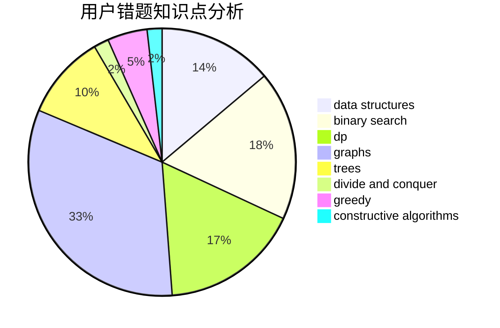

# C20193618

<!-- tabs:start -->

#### **用户提交结果分析**

#### **用户做题类型偏好分析**

#### **用户错题知识点分析**

<!-- tabs:end -->
# 推荐题目
[607B](https://codeforces.com/contest/607/problem/B)		dp		  
[1331E](https://codeforces.com/contest/1331/problem/E)		dfs and similar,
                        geometry,
                        implementation		  
[607E](https://codeforces.com/contest/607/problem/E)		binary search,
                        geometry		  
[174B](https://codeforces.com/contest/174/problem/B)		dp,
                        greedy,
                        implementation		  
[605C](https://codeforces.com/contest/605/problem/C)		geometry		  
[14C](https://codeforces.com/contest/14/problem/C)		brute force,
                        constructive algorithms,
                        geometry,
                        implementation,
                        math		  
[1156A](https://codeforces.com/contest/1156/problem/A)		geometry		  
[607D](https://codeforces.com/contest/607/problem/D)		data structures,
                        trees		  
[119D](https://codeforces.com/contest/119/problem/D)		hashing,
                        strings		  
[1151F](https://codeforces.com/contest/1151/problem/F)		combinatorics,
                        dp,
                        matrices,
                        probabilities		  
