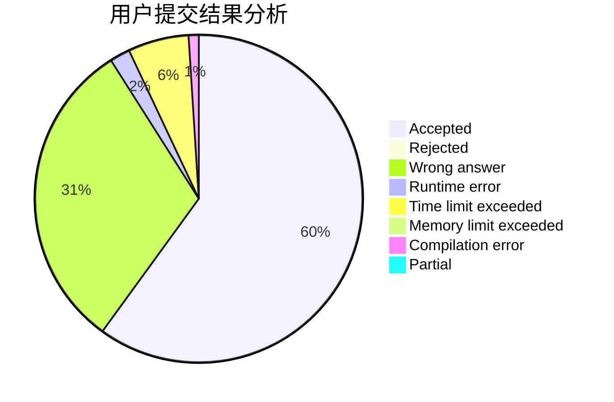
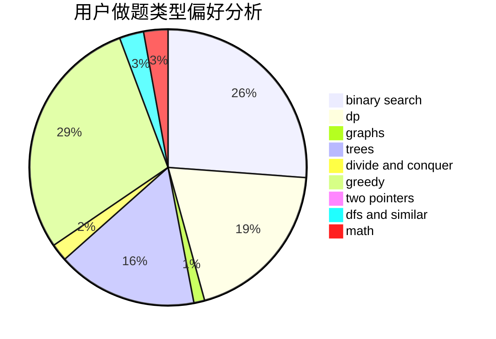

# reboot_restart

<!-- tabs:start -->

#### **用户提交结果分析**

#### **用户做题类型偏好分析**

<!-- tabs:end -->
# 推荐题目
[1107C](https://codeforces.com/contest/1107/problem/C)
[821B](https://codeforces.com/contest/821/problem/B)
[7E](https://codeforces.com/contest/7/problem/E)
[1132G](https://codeforces.com/contest/1132/problem/G)
[1341E](https://codeforces.com/contest/1341/problem/E)
[377D](https://codeforces.com/contest/377/problem/D)
[710E](https://codeforces.com/contest/710/problem/E)
[483D](https://codeforces.com/contest/483/problem/D)
[1221G](https://codeforces.com/contest/1221/problem/G)
[205C](https://codeforces.com/contest/205/problem/C)
